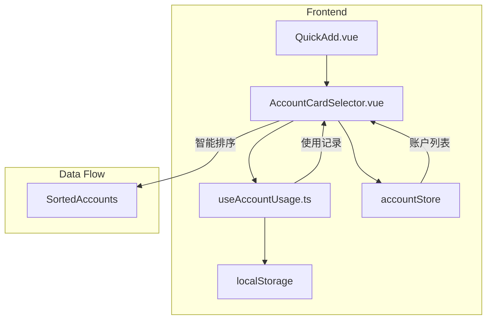

# 设计文档

## 概述

本设计实现账户卡片选择器功能，将新增账单页面的账户选择从下拉框改为卡片网格形式，并实现基于使用频率和最近使用时间的智能排序。该功能将提升用户记账效率，提供与分类选择器一致的交互体验。

## 架构

### 整体架构



### 数据流

1. 用户进入记账页面
2. 从 accountStore 获取账户列表
3. 从 localStorage 获取使用记录
4. 智能排序算法计算排序
5. 渲染排序后的账户卡片
6. 用户选择账户并提交交易
7. 更新使用记录到 localStorage

## 组件和接口

### 1. AccountCardSelector 组件

新建 Vue 组件，负责账户卡片的展示和选择逻辑。

```typescript
// frontend/src/components/account/AccountCardSelector.vue

interface Props {
  modelValue: number | null; // 选中的账户 ID
  accounts: Account[]; // 账户列表
}

interface Emits {
  (e: "update:modelValue", value: number | null): void;
}
```

### 2. useAccountUsage Composable

新建 Composable，负责账户使用记录的追踪和智能排序。

```typescript
// frontend/src/composables/useAccountUsage.ts

interface AccountUsageRecord {
  accountId: number;
  usageCount: number;
  lastUsedAt: string; // ISO 日期字符串
}

interface UseAccountUsageReturn {
  // 获取排序后的账户列表
  getSortedAccounts: (accounts: Account[]) => Account[];
  // 记录账户使用
  recordUsage: (accountId: number) => void;
  // 获取账户使用记录
  getUsageRecord: (accountId: number) => AccountUsageRecord | null;
}
```

### 3. 账户类型图标映射

扩展现有的 iconMap 工具，添加账户类型的默认图标映射。

```typescript
// frontend/src/utils/iconMap.ts

const accountTypeIconMap: Record<AccountType, string> = {
  cash: "Wallet",
  bank: "CreditCard",
  alipay: "Promotion",
  wechat: "ChatDotRound",
  credit: "Postcard",
  investment: "TrendCharts",
  other: "More",
};

function getAccountIcon(account: Account): string;
```

## 数据模型

### 使用记录存储结构

```typescript
// localStorage key: 'account_usage_records'
interface AccountUsageStorage {
  version: number; // 数据版本，用于未来迁移
  records: AccountUsageRecord[];
}

interface AccountUsageRecord {
  accountId: number;
  usageCount: number;
  lastUsedAt: string; // ISO 8601 格式
}
```

### 智能排序评分算法

```typescript
interface SortScore {
  accountId: number;
  score: number;
  usageScore: number; // 使用频率得分 (0-100)
  recencyScore: number; // 最近使用得分 (0-100)
}

// 评分计算公式
// score = usageScore * 0.6 + recencyScore * 0.4

// usageScore 计算：
// usageScore = (usageCount / maxUsageCount) * 100

// recencyScore 计算（基于最近使用时间的衰减）：
// daysSinceLastUse = (now - lastUsedAt) / (1000 * 60 * 60 * 24)
// recencyScore = Math.max(0, 100 - daysSinceLastUse * 3.33)
// 30 天后衰减到 0
```

## 正确性属性

_正确性属性是系统在所有有效执行中都应保持为真的特征或行为——本质上是关于系统应该做什么的形式化陈述。属性作为人类可读规范和机器可验证正确性保证之间的桥梁。_

### Property 1: 账户卡片渲染完整性

_对于任意_ 账户数据，渲染后的卡片应包含账户名称和账户图标两个必要元素。

**Validates: Requirements 1.2**

### Property 2: 使用次数递增不变量

_对于任意_ 账户和任意初始使用次数 n，调用 recordUsage 后，该账户的使用次数应为 n + 1。

**Validates: Requirements 2.1, 2.3**

### Property 3: 使用记录持久化往返

_对于任意_ 账户使用记录，存储到 localStorage 后再读取，应得到等价的记录数据。

**Validates: Requirements 2.4**

### Property 4: 智能排序降序性

_对于任意_ 账户列表和使用记录，排序后的列表中，任意相邻两个账户 A 和 B（A 在 B 前面），A 的综合评分应大于等于 B 的综合评分。

**Validates: Requirements 3.1, 3.4**

### Property 5: 评分权重正确性

_对于任意_ 账户使用记录，计算的综合评分应等于 usageScore _ 0.6 + recencyScore _ 0.4。

**Validates: Requirements 3.2**

### Property 6: 图标选择优先级

_对于任意_ 账户，如果账户有自定义图标则返回自定义图标，否则返回该账户类型的默认图标。

**Validates: Requirements 6.1, 6.2, 6.3**

### Property 7: 账户类型图标完备性

_对于任意_ 有效的账户类型（cash、bank、alipay、wechat、credit、investment、other），应存在对应的默认图标映射。

**Validates: Requirements 6.1**

## 错误处理

### localStorage 不可用

当 localStorage 不可用时（如隐私模式）：

- 使用内存存储作为降级方案
- 不影响核心功能，仅排序功能退化为默认顺序
- 控制台输出警告信息

### 账户数据异常

当账户数据格式异常时：

- 跳过异常账户，继续渲染其他账户
- 记录错误日志便于排查

### 使用记录数据损坏

当 localStorage 中的使用记录数据损坏时：

- 清除损坏数据，重新初始化
- 不影响用户正常使用

## 测试策略

### 单元测试

使用 Vitest 进行单元测试，覆盖以下场景：

1. **useAccountUsage Composable**

   - recordUsage 正确更新使用次数
   - recordUsage 正确更新最近使用时间
   - getSortedAccounts 返回正确排序的列表
   - localStorage 读写正确性

2. **图标映射函数**

   - 所有账户类型都有默认图标
   - 自定义图标优先级正确

3. **评分计算**
   - 权重计算正确
   - 边界值处理（0 次使用、30 天前使用等）

### 属性测试

使用 fast-check 进行属性测试，每个属性至少运行 100 次迭代：

1. **Property 1**: 生成随机账户数据，验证渲染完整性
2. **Property 2**: 生成随机初始使用次数，验证递增不变量
3. **Property 3**: 生成随机使用记录，验证往返一致性
4. **Property 4**: 生成随机账户列表和使用记录，验证排序降序性
5. **Property 5**: 生成随机评分输入，验证权重计算
6. **Property 6**: 生成随机账户（有/无自定义图标），验证图标选择
7. **Property 7**: 遍历所有账户类型，验证图标映射完备性

### 测试配置

```typescript
// vitest.config.ts
export default {
  test: {
    // 属性测试配置
    testTimeout: 30000, // 属性测试可能需要更长时间
  },
};
```

### 测试标注格式

每个属性测试必须包含以下注释：

```typescript
/**
 * Feature: account-card-selector
 * Property N: [属性标题]
 * Validates: Requirements X.Y
 */
```
