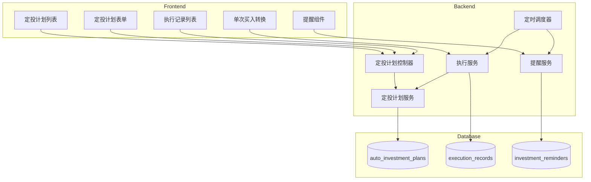

# 设计文档

## 概述

定投功能为用户提供自动化的定期投资能力。系统通过定时任务自动执行定投计划，从指定账户扣款并买入投资产品。同时支持带折扣的单次买入转换功能。

核心设计原则：

- 渐进式设计：从简单的定投计划开始，按需扩展
- 数据一致性：使用事务确保扣款和买入的原子性
- 可追溯性：完整记录每次执行的详细信息

## 架构



## 组件和接口

### 数据模型

#### AutoInvestmentPlan（定投计划）

```typescript
interface AutoInvestmentPlan {
  id: number;
  userId: number;
  name: string; // 计划名称
  sourceAccountId: number; // 资金来源账户
  targetAccountId: number; // 目标投资账户
  amount: number; // 定投金额
  frequency: "daily" | "weekly" | "monthly"; // 执行频率
  executionDay?: number; // 执行日（周几1-7 或 月几1-31）
  executionTime: string; // 执行时间 HH:mm
  status: "active" | "paused" | "deleted"; // 状态
  nextExecutionDate: string; // 下次执行日期
  createdAt: Date;
  updatedAt: Date;
}
```

#### ExecutionRecord（执行记录）

```typescript
interface ExecutionRecord {
  id: number;
  planId: number | null; // 关联的定投计划（单次买入为null）
  userId: number;
  sourceAccountId: number;
  targetAccountId: number;
  paidAmount: number; // 实际支付金额
  investedAmount: number; // 获得的投资金额
  discountRate: number; // 折扣率（1.0 表示无折扣）
  shares: number; // 买入份额
  netValue: number; // 买入时净值
  status: "success" | "failed"; // 执行状态
  failReason?: string; // 失败原因
  executedAt: Date;
  createdAt: Date;
}
```

#### InvestmentReminder（投资提醒）

```typescript
interface InvestmentReminder {
  id: number;
  userId: number;
  planId: number;
  type: "execution_failed" | "insufficient_balance";
  message: string;
  isRead: boolean;
  createdAt: Date;
}
```

### 服务接口

#### AutoInvestmentPlanService

```typescript
interface AutoInvestmentPlanService {
  // 创建定投计划
  create(params: CreatePlanParams): Promise<AutoInvestmentPlan>;

  // 获取用户的定投计划列表
  getByUserId(userId: number): Promise<AutoInvestmentPlan[]>;

  // 获取单个计划详情
  getById(id: number, userId: number): Promise<AutoInvestmentPlan>;

  // 更新定投计划
  update(
    id: number,
    userId: number,
    params: UpdatePlanParams
  ): Promise<AutoInvestmentPlan>;

  // 暂停定投计划
  pause(id: number, userId: number): Promise<AutoInvestmentPlan>;

  // 恢复定投计划
  resume(id: number, userId: number): Promise<AutoInvestmentPlan>;

  // 删除定投计划（软删除）
  delete(id: number, userId: number): Promise<void>;

  // 计算下次执行日期
  calculateNextExecutionDate(plan: AutoInvestmentPlan): string;

  // 获取待执行的计划
  getPendingPlans(date: string): Promise<AutoInvestmentPlan[]>;
}
```

#### ExecutionService

```typescript
interface ExecutionService {
  // 执行定投计划
  executePlan(plan: AutoInvestmentPlan): Promise<ExecutionRecord>;

  // 单次买入转换（支持折扣）
  executeOneTimeBuy(params: OneTimeBuyParams): Promise<ExecutionRecord>;

  // 获取执行记录
  getRecords(
    userId: number,
    filters: RecordFilters
  ): Promise<ExecutionRecord[]>;

  // 获取计划的执行记录
  getRecordsByPlanId(
    planId: number,
    userId: number
  ): Promise<ExecutionRecord[]>;
}
```

#### ReminderService

```typescript
interface ReminderService {
  // 创建提醒
  create(params: CreateReminderParams): Promise<InvestmentReminder>;

  // 获取用户未读提醒
  getUnreadByUserId(userId: number): Promise<InvestmentReminder[]>;

  // 标记为已读
  markAsRead(id: number, userId: number): Promise<void>;

  // 检查余额不足预警
  checkInsufficientBalance(userId: number): Promise<void>;
}
```

### API 端点

```typescript
// 定投计划
POST   /api/auto-investment/plans           // 创建计划
GET    /api/auto-investment/plans           // 获取计划列表
GET    /api/auto-investment/plans/:id       // 获取计划详情
PUT    /api/auto-investment/plans/:id       // 更新计划
POST   /api/auto-investment/plans/:id/pause // 暂停计划
POST   /api/auto-investment/plans/:id/resume // 恢复计划
DELETE /api/auto-investment/plans/:id       // 删除计划

// 执行记录
GET    /api/auto-investment/records         // 获取执行记录
POST   /api/auto-investment/one-time-buy    // 单次买入转换

// 提醒
GET    /api/auto-investment/reminders       // 获取提醒
POST   /api/auto-investment/reminders/:id/read // 标记已读
```

## 数据模型

### 数据库表结构

```sql
-- 定投计划表
CREATE TABLE auto_investment_plans (
  id INT UNSIGNED AUTO_INCREMENT PRIMARY KEY,
  user_id INT UNSIGNED NOT NULL,
  name VARCHAR(100) NOT NULL,
  source_account_id INT UNSIGNED NOT NULL,
  target_account_id INT UNSIGNED NOT NULL,
  amount DECIMAL(15, 2) NOT NULL,
  frequency ENUM('daily', 'weekly', 'monthly') NOT NULL,
  execution_day TINYINT,
  execution_time VARCHAR(5) NOT NULL DEFAULT '09:00',
  status ENUM('active', 'paused', 'deleted') NOT NULL DEFAULT 'active',
  next_execution_date DATE NOT NULL,
  created_at TIMESTAMP DEFAULT CURRENT_TIMESTAMP,
  updated_at TIMESTAMP DEFAULT CURRENT_TIMESTAMP ON UPDATE CURRENT_TIMESTAMP,

  FOREIGN KEY (user_id) REFERENCES users(id),
  FOREIGN KEY (source_account_id) REFERENCES accounts(id),
  FOREIGN KEY (target_account_id) REFERENCES accounts(id),
  INDEX idx_user_status (user_id, status),
  INDEX idx_next_execution (next_execution_date, status)
);

-- 执行记录表
CREATE TABLE execution_records (
  id INT UNSIGNED AUTO_INCREMENT PRIMARY KEY,
  plan_id INT UNSIGNED,
  user_id INT UNSIGNED NOT NULL,
  source_account_id INT UNSIGNED NOT NULL,
  target_account_id INT UNSIGNED NOT NULL,
  paid_amount DECIMAL(15, 2) NOT NULL,
  invested_amount DECIMAL(15, 2) NOT NULL,
  discount_rate DECIMAL(5, 4) NOT NULL DEFAULT 1.0000,
  shares DECIMAL(15, 4) NOT NULL,
  net_value DECIMAL(15, 4) NOT NULL,
  status ENUM('success', 'failed') NOT NULL,
  fail_reason VARCHAR(255),
  executed_at TIMESTAMP NOT NULL,
  created_at TIMESTAMP DEFAULT CURRENT_TIMESTAMP,

  FOREIGN KEY (plan_id) REFERENCES auto_investment_plans(id),
  FOREIGN KEY (user_id) REFERENCES users(id),
  INDEX idx_user_executed (user_id, executed_at),
  INDEX idx_plan_executed (plan_id, executed_at)
);

-- 投资提醒表
CREATE TABLE investment_reminders (
  id INT UNSIGNED AUTO_INCREMENT PRIMARY KEY,
  user_id INT UNSIGNED NOT NULL,
  plan_id INT UNSIGNED NOT NULL,
  type ENUM('execution_failed', 'insufficient_balance') NOT NULL,
  message VARCHAR(500) NOT NULL,
  is_read BOOLEAN NOT NULL DEFAULT FALSE,
  created_at TIMESTAMP DEFAULT CURRENT_TIMESTAMP,

  FOREIGN KEY (user_id) REFERENCES users(id),
  FOREIGN KEY (plan_id) REFERENCES auto_investment_plans(id),
  INDEX idx_user_unread (user_id, is_read)
);
```

### 核心计算逻辑

#### 下次执行日期计算

```typescript
function calculateNextExecutionDate(
  frequency: "daily" | "weekly" | "monthly",
  executionDay: number | undefined,
  currentDate: Date
): string {
  const next = new Date(currentDate);

  switch (frequency) {
    case "daily":
      next.setDate(next.getDate() + 1);
      break;

    case "weekly":
      // executionDay: 1-7 (周一到周日)
      const currentDay = next.getDay() || 7;
      const daysUntilNext = (executionDay! - currentDay + 7) % 7 || 7;
      next.setDate(next.getDate() + daysUntilNext);
      break;

    case "monthly":
      // executionDay: 1-31
      next.setMonth(next.getMonth() + 1);
      // 处理月末日期
      const lastDayOfMonth = new Date(
        next.getFullYear(),
        next.getMonth() + 1,
        0
      ).getDate();
      next.setDate(Math.min(executionDay!, lastDayOfMonth));
      break;
  }

  return next.toISOString().split("T")[0];
}
```

#### 份额计算

```typescript
function calculateShares(investedAmount: number, netValue: number): number {
  // 份额 = 投资金额 / 净值，保留4位小数
  return Math.round((investedAmount / netValue) * 10000) / 10000;
}
```

#### 折扣率计算

```typescript
function calculateDiscountRate(
  paidAmount: number,
  investedAmount: number
): number {
  // 折扣率 = 实际支付 / 获得金额
  // 例如：95元买100元基金，折扣率 = 0.95
  return Math.round((paidAmount / investedAmount) * 10000) / 10000;
}
```

## 正确性属性

_正确性属性是系统在所有有效执行中都应保持为真的特征或行为——本质上是关于系统应该做什么的形式化陈述。属性作为人类可读规范和机器可验证正确性保证之间的桥梁。_

### Property 1: 定投计划数据完整性

_对于任意_ 创建的定投计划，该计划必须包含名称、资金来源账户、目标投资账户、定投金额、执行频率和下次执行时间，且所有字段值有效。

**Validates: Requirements 1.1, 2.1**

### Property 2: 频率类型支持

_对于任意_ 定投计划的频率设置，系统必须正确处理 daily、weekly、monthly 三种频率类型，weekly 类型必须包含有效的周几（1-7），monthly 类型必须包含有效的日期（1-31）。

**Validates: Requirements 1.2**

### Property 3: 月末日期调整

_对于任意_ 月度定投计划，当执行日期设置为 29-31 日且当月无该日期时，实际执行日期必须调整为当月最后一天。

**Validates: Requirements 1.3**

### Property 4: 状态管理

_对于任意_ 定投计划，创建时状态必须为 active；暂停后状态必须为 paused 且不会被调度执行；恢复后状态必须为 active 且下次执行时间被重新计算。

**Validates: Requirements 1.4, 2.3, 2.4**

### Property 5: 账户类型验证

_对于任意_ 创建定投计划的请求，如果资金来源账户类型为 investment，系统必须拒绝创建并返回错误。

**Validates: Requirements 1.5**

### Property 6: 计划编辑

_对于任意_ 定投计划的编辑操作，修改后的字段值必须正确更新，未修改的字段值必须保持不变。

**Validates: Requirements 2.2**

### Property 7: 软删除保留记录

_对于任意_ 被删除的定投计划，其历史执行记录必须保留，且计划状态变为 deleted 后不再被调度执行。

**Validates: Requirements 2.5**

### Property 8: 调度器触发

_对于任意_ 到达执行时间的定投计划，如果状态为 active，调度器必须触发执行；如果状态为 paused 或 deleted，调度器不得触发执行。

**Validates: Requirements 3.1**

### Property 9: 账户余额变化

_对于任意_ 成功执行的定投或单次买入，资金来源账户余额必须减少实际支付金额（paidAmount），且减少金额精确到分。

**Validates: Requirements 3.2, 4.3**

### Property 10: 份额计算

_对于任意_ 成功执行的定投或单次买入，投资账户增加的份额必须等于 investedAmount / netValue，精确到 4 位小数。

**Validates: Requirements 3.3, 4.4**

### Property 11: 余额不足处理

_对于任意_ 资金来源账户余额小于定投金额的执行，系统必须记录执行失败，失败原因为余额不足，且不扣减任何账户余额。

**Validates: Requirements 3.4**

### Property 12: 执行记录完整性

_对于任意_ 执行记录，必须包含执行时间、实际支付金额、获得金额、折扣率、买入份额、买入净值和执行状态。

**Validates: Requirements 3.5, 4.5**

### Property 13: 下次执行时间更新

_对于任意_ 成功执行的定投计划，下次执行时间必须根据频率正确更新：daily 加 1 天，weekly 加 7 天，monthly 加 1 个月（考虑月末调整）。

**Validates: Requirements 3.6**

### Property 14: 折扣率计算

_对于任意_ 单次买入转换，折扣率必须等于 paidAmount / investedAmount，当 paidAmount < investedAmount 时折扣率小于 1。

**Validates: Requirements 4.2**

### Property 15: 记录筛选

_对于任意_ 执行记录查询，按计划筛选时只返回该计划的记录，按时间范围筛选时只返回该时间段内的记录。

**Validates: Requirements 5.2, 5.3**

### Property 16: 提醒生成

_对于任意_ 执行失败的定投，系统必须生成 execution_failed 类型的提醒；对于任意余额不足的预警检查，系统必须生成 insufficient_balance 类型的提醒。

**Validates: Requirements 6.1, 6.2**

## 错误处理

| 错误场景               | 错误码                 | 处理方式                    |
| ---------------------- | ---------------------- | --------------------------- |
| 资金来源账户为投资账户 | INVALID_SOURCE_ACCOUNT | 拒绝创建，返回错误提示      |
| 目标账户非投资账户     | INVALID_TARGET_ACCOUNT | 拒绝创建，返回错误提示      |
| 账户不存在             | ACCOUNT_NOT_FOUND      | 返回 404 错误               |
| 定投计划不存在         | PLAN_NOT_FOUND         | 返回 404 错误               |
| 余额不足               | INSUFFICIENT_BALANCE   | 记录失败，生成提醒          |
| 无权限操作             | UNAUTHORIZED           | 返回 403 错误               |
| 参数验证失败           | VALIDATION_ERROR       | 返回 400 错误，说明具体字段 |

## 测试策略

### 单元测试

- 下次执行日期计算逻辑
- 份额计算逻辑
- 折扣率计算逻辑
- 月末日期调整逻辑
- 账户类型验证逻辑

### 属性测试

使用 fast-check 进行属性测试，每个属性测试至少运行 100 次迭代。

测试重点：

- 日期计算的边界情况（月末、闰年）
- 金额计算的精度
- 状态转换的正确性
- 筛选逻辑的完整性

### 集成测试

- 定投执行的完整流程（扣款 → 买入 → 记录）
- 事务回滚（扣款成功但买入失败）
- 并发执行的数据一致性
