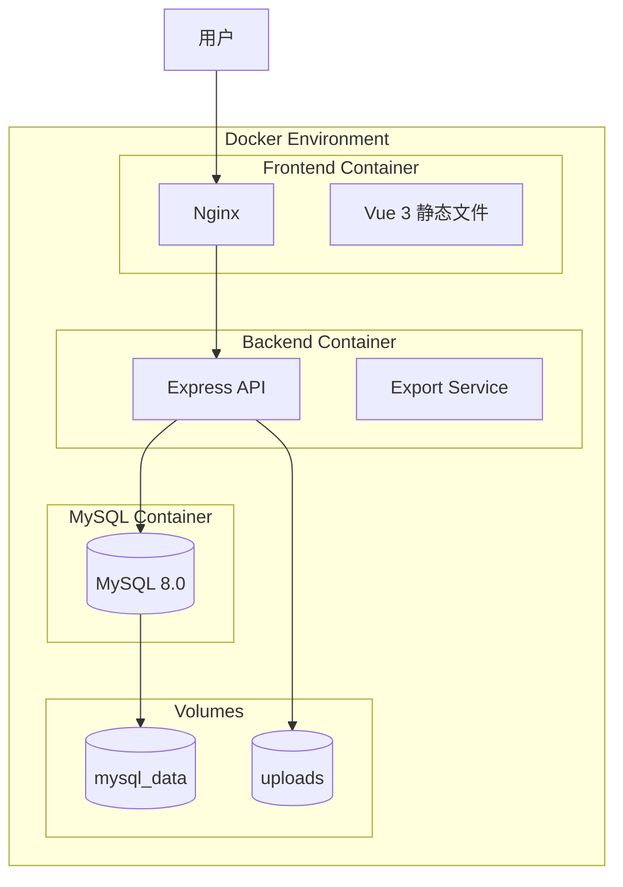
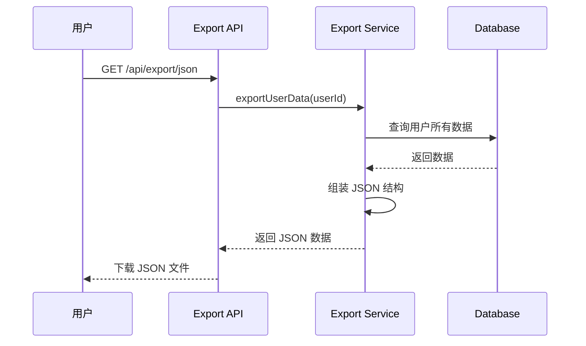

# 设计文档

## 概述

本设计文档描述数据导出功能和 Docker 容器化部署的技术实现方案。数据导出功能通过新增 API 端点和服务层实现，支持 JSON 和 CSV 两种格式。Docker 部署通过 Docker Compose 编排前端、后端和 MySQL 数据库三个服务，使用命名卷确保数据持久化。

## 架构

### 整体架构图



### 数据导出流程



## 组件和接口

### 1. Export Service（导出服务）

```typescript
// backend/src/services/export.service.ts

interface ExportData {
  version: string;
  exportedAt: string;
  user: UserExportData;
  accounts: AccountExportData[];
  categories: CategoryExportData[];
  billTypes: BillTypeExportData[];
  transactions: TransactionExportData[];
  budgets: BudgetExportData[];
  family?: FamilyExportData;
}

interface ImportResult {
  success: number;
  skipped: number;
  failed: number;
  errors: string[];
}

class ExportService {
  // 导出用户所有数据为 JSON
  async exportToJson(
    userId: number,
    includeFamily?: boolean
  ): Promise<ExportData>;

  // 导出交易记录为 CSV
  async exportToCsv(
    userId: number,
    startDate?: Date,
    endDate?: Date
  ): Promise<string>;

  // 导入 JSON 数据
  async importFromJson(
    userId: number,
    data: ExportData,
    mode: "skip" | "overwrite"
  ): Promise<ImportResult>;

  // 验证导入数据格式
  validateImportData(data: unknown): { valid: boolean; errors: string[] };
}
```

### 2. Export Controller（导出控制器）

```typescript
// backend/src/controllers/export.controller.ts

// GET /api/export/json - 导出 JSON
// GET /api/export/csv - 导出 CSV
// POST /api/export/import - 导入数据
```

### 3. Export Routes（导出路由）

```typescript
// backend/src/routes/export.routes.ts

router.get("/json", auth, exportController.exportJson);
router.get("/csv", auth, exportController.exportCsv);
router.post(
  "/import",
  auth,
  upload.single("file"),
  exportController.importData
);
```

## 数据模型

### 导出数据结构

```typescript
// 导出文件版本
const EXPORT_VERSION = "1.0.0";

interface UserExportData {
  username: string;
  email: string;
  nickname?: string;
}

interface AccountExportData {
  name: string;
  type: string;
  balance: number;
  icon?: string;
  color?: string;
  isDefault: boolean;
  // 信用卡相关字段
  isCreditCard?: boolean;
  creditLimit?: number;
  billingDay?: number;
  repaymentDay?: number;
}

interface CategoryExportData {
  name: string;
  type: "income" | "expense";
  icon?: string;
  color?: string;
  isSystem: boolean;
  parentName?: string; // 用于关联父分类
}

interface BillTypeExportData {
  name: string;
  description?: string;
  isSystem: boolean;
}

interface TransactionExportData {
  type: "income" | "expense";
  amount: number;
  date: string;
  accountName: string;
  categoryName: string;
  billTypeName?: string;
  description?: string;
  tags?: string[];
  isFamily: boolean;
}

interface BudgetExportData {
  categoryName: string;
  amount: number;
  period: "monthly" | "yearly";
  startDate: string;
  endDate?: string;
}

interface FamilyExportData {
  name: string;
  members: { username: string; role: string }[];
  transactions: TransactionExportData[];
}
```

### CSV 导出格式

| 字段     | 说明                  |
| -------- | --------------------- |
| 日期     | 交易日期 (YYYY-MM-DD) |
| 类型     | 收入/支出             |
| 金额     | 交易金额              |
| 分类     | 分类名称              |
| 账户     | 账户名称              |
| 账单类型 | 账单类型名称          |
| 备注     | 交易备注              |
| 标签     | 标签（逗号分隔）      |

## Docker 配置

### docker-compose.yml（开发环境）

```yaml
version: "3.8"

services:
  mysql:
    image: mysql:8.0
    container_name: family-accounting-mysql
    environment:
      MYSQL_ROOT_PASSWORD: ${DB_ROOT_PASSWORD}
      MYSQL_DATABASE: ${DB_NAME}
      MYSQL_USER: ${DB_USER}
      MYSQL_PASSWORD: ${DB_PASSWORD}
    volumes:
      - mysql_data:/var/lib/mysql
      - ./backend/src/scripts/initDb.sql:/docker-entrypoint-initdb.d/init.sql
    ports:
      - "3306:3306"
    healthcheck:
      test: ["CMD", "mysqladmin", "ping", "-h", "localhost"]
      interval: 10s
      timeout: 5s
      retries: 5
    restart: unless-stopped

  backend:
    build:
      context: ./backend
      dockerfile: Dockerfile
    container_name: family-accounting-backend
    environment:
      - NODE_ENV=production
      - DB_HOST=mysql
      - DB_PORT=3306
      - DB_NAME=${DB_NAME}
      - DB_USER=${DB_USER}
      - DB_PASSWORD=${DB_PASSWORD}
      - JWT_SECRET=${JWT_SECRET}
      - DEEPSEEK_API_KEY=${DEEPSEEK_API_KEY}
    ports:
      - "3000:3000"
    depends_on:
      mysql:
        condition: service_healthy
    restart: unless-stopped

  frontend:
    build:
      context: ./frontend
      dockerfile: Dockerfile
      args:
        - VITE_API_BASE_URL=${VITE_API_BASE_URL}
    container_name: family-accounting-frontend
    ports:
      - "80:80"
    depends_on:
      - backend
    restart: unless-stopped

volumes:
  mysql_data:
    name: family-accounting-mysql-data
```

### Backend Dockerfile

```dockerfile
# backend/Dockerfile
FROM node:18-alpine AS builder
WORKDIR /app
COPY package*.json ./
RUN npm ci
COPY . .
RUN npm run build

FROM node:18-alpine
WORKDIR /app
COPY --from=builder /app/dist ./dist
COPY --from=builder /app/node_modules ./node_modules
COPY package*.json ./
EXPOSE 3000
CMD ["node", "dist/index.js"]
```

### Frontend Dockerfile

```dockerfile
# frontend/Dockerfile
FROM node:18-alpine AS builder
WORKDIR /app
ARG VITE_API_BASE_URL
ENV VITE_API_BASE_URL=$VITE_API_BASE_URL
COPY package*.json ./
RUN npm ci
COPY . .
RUN npm run build

FROM nginx:alpine
COPY --from=builder /app/dist /usr/share/nginx/html
COPY nginx.conf /etc/nginx/conf.d/default.conf
EXPOSE 80
CMD ["nginx", "-g", "daemon off;"]
```

### Nginx 配置

```nginx
# frontend/nginx.conf
server {
    listen 80;
    server_name localhost;
    root /usr/share/nginx/html;
    index index.html;

    location / {
        try_files $uri $uri/ /index.html;
    }

    location /api {
        proxy_pass http://backend:3000;
        proxy_http_version 1.1;
        proxy_set_header Upgrade $http_upgrade;
        proxy_set_header Connection 'upgrade';
        proxy_set_header Host $host;
        proxy_cache_bypass $http_upgrade;
    }
}
```

## 错误处理

### 导出错误

| 错误码         | 说明         | 处理方式       |
| -------------- | ------------ | -------------- |
| EXPORT_NO_DATA | 用户没有数据 | 返回空数据结构 |
| EXPORT_FAILED  | 导出过程失败 | 返回 500 错误  |

### 导入错误

| 错误码                  | 说明         | 处理方式                |
| ----------------------- | ------------ | ----------------------- |
| IMPORT_INVALID_FORMAT   | 文件格式无效 | 返回 400 错误和详细信息 |
| IMPORT_VERSION_MISMATCH | 版本不兼容   | 返回 400 错误和版本信息 |
| IMPORT_PARTIAL_FAILURE  | 部分导入失败 | 返回成功但包含失败详情  |

### Docker 错误

| 场景         | 处理方式             |
| ------------ | -------------------- |
| 数据库未就绪 | 后端等待健康检查通过 |
| 容器崩溃     | 自动重启策略         |
| 数据卷丢失   | 提供备份恢复文档     |

## 正确性属性

_正确性属性是系统在所有有效执行中都应保持为真的特征或行为——本质上是关于系统应该做什么的形式化陈述。属性作为人类可读规范和机器可验证正确性保证之间的桥梁。_

### Property 1: 导出数据完整性

_对于任意_ 拥有数据的用户，导出操作应返回包含所有账户、分类、账单类型、交易记录和预算数据的有效 JSON 结构，且包含版本号和导出时间戳。

**Validates: Requirements 1.1, 1.2, 1.4**

### Property 2: 家庭数据导出

_对于任意_ 属于家庭的用户，当请求包含家庭数据时，导出结果应包含家庭信息和家庭共享交易记录。

**Validates: Requirements 1.3**

### Property 3: CSV 导出完整性

_对于任意_ 交易记录集合，CSV 导出应生成包含日期、类型、金额、分类、账户、账单类型、备注字段的有效 CSV 格式，且以 UTF-8 BOM 开头。

**Validates: Requirements 2.1, 2.2, 2.4**

### Property 4: CSV 日期范围过滤

_对于任意_ 日期范围和交易记录集合，CSV 导出应仅包含指定日期范围内的交易记录。

**Validates: Requirements 2.3**

### Property 5: 导入数据验证

_对于任意_ 输入数据，导入验证应正确识别有效格式（返回 valid: true）和无效格式（返回 valid: false 及错误信息）。

**Validates: Requirements 3.1**

### Property 6: 导出-导入往返一致性

_对于任意_ 用户数据，导出为 JSON 后再导入，应能恢复等价的数据（账户、分类、交易等记录数量和内容一致）。

**Validates: Requirements 3.2**

### Property 7: 导入冲突处理

_对于任意_ 存在冲突的导入数据，跳过模式应保留原有数据，覆盖模式应使用新数据替换。

**Validates: Requirements 3.3**

### Property 8: 导入统计准确性

_对于任意_ 导入操作，返回的统计信息（成功数 + 跳过数 + 失败数）应等于输入数据的总记录数。

**Validates: Requirements 3.4**

## 测试策略

### 双重测试方法

本功能采用单元测试和属性测试相结合的方式：

- **单元测试**: 验证特定示例、边界情况和错误条件
- **属性测试**: 验证所有输入的通用属性

### 属性测试配置

- 测试框架: fast-check（已在项目中使用）
- 每个属性测试最少运行 100 次迭代
- 每个测试必须标注对应的设计属性
- 标签格式: **Feature: data-export-docker, Property {number}: {property_text}**

### 单元测试覆盖

| 测试类型 | 覆盖内容                     |
| -------- | ---------------------------- |
| 边界情况 | 空数据用户导出、无效格式导入 |
| 错误处理 | 版本不兼容、文件损坏         |
| 配置验证 | Docker Compose 配置正确性    |

### 属性测试覆盖

| 属性       | 测试内容                               |
| ---------- | -------------------------------------- |
| Property 1 | 生成随机用户数据，验证导出完整性       |
| Property 2 | 生成有家庭的用户，验证家庭数据导出     |
| Property 3 | 生成随机交易，验证 CSV 格式和字段      |
| Property 4 | 生成随机日期范围，验证过滤正确性       |
| Property 5 | 生成各种格式输入，验证验证逻辑         |
| Property 6 | 导出后导入，验证数据一致性（往返测试） |
| Property 7 | 创建冲突场景，验证跳过/覆盖行为        |
| Property 8 | 导入后验证统计数字准确性               |

### Docker 配置测试

Docker 相关需求主要通过示例测试验证配置文件的正确性：

- 验证 docker-compose.yml 包含三个服务
- 验证 depends_on 和 healthcheck 配置
- 验证命名卷配置
- 验证多阶段构建 Dockerfile
- 验证环境变量使用
