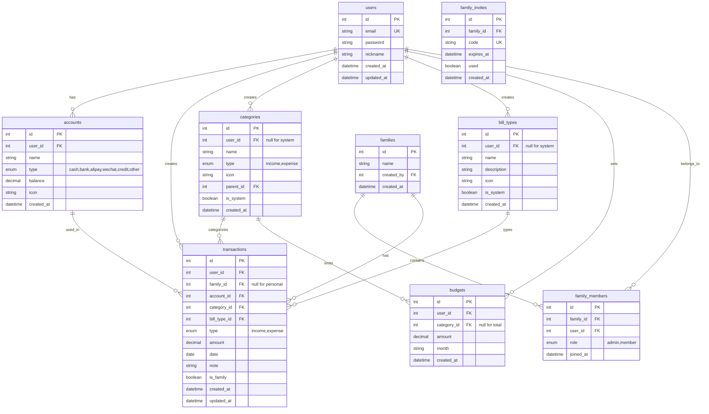

# 设计文档：家庭记账系统

## 概述

家庭记账系统采用前后端分离架构，前端使用 Vue 3 + TypeScript + Vite 构建，后端使用 Node.js + Express + TypeScript，数据库使用 MySQL。系统集成 DeepSeek API 提供 AI 智能分析功能。

### 技术栈

**前端：**

- Vue 3 + Composition API
- TypeScript
- Vite
- Pinia（状态管理）
- Vue Router
- Element Plus（UI 组件库）
- ECharts（图表）
- Axios（HTTP 请求）

**后端：**

- Node.js + Express
- TypeScript
- MySQL 8.0
- Sequelize ORM
- JWT（身份验证）
- bcrypt（密码加密）

**AI 服务：**

- DeepSeek API

## 架构


### 目录结构

```
family-accounting/
├── frontend/                    # 前端项目
│   ├── src/
│   │   ├── api/                # API 接口
│   │   ├── assets/             # 静态资源
│   │   ├── components/         # 公共组件
│   │   ├── composables/        # 组合式函数
│   │   ├── layouts/            # 布局组件
│   │   ├── router/             # 路由配置
│   │   ├── stores/             # Pinia 状态
│   │   ├── types/              # TypeScript 类型
│   │   ├── utils/              # 工具函数
│   │   └── views/              # 页面组件
│   └── package.json
├── backend/                     # 后端项目
│   ├── src/
│   │   ├── config/             # 配置文件
│   │   ├── controllers/        # 控制器
│   │   ├── middleware/         # 中间件
│   │   ├── models/             # 数据模型
│   │   ├── routes/             # 路由
│   │   ├── services/           # 业务逻辑
│   │   ├── types/              # TypeScript 类型
│   │   └── utils/              # 工具函数
│   └── package.json
└── README.md
```

## 组件与接口

### 后端 API 接口

#### 认证模块 (Auth)

```typescript
// POST /api/auth/register - 用户注册
interface RegisterRequest {
  email: string;
  password: string;
  nickname: string;
}
interface RegisterResponse {
  id: number;
  email: string;
  nickname: string;
}

// POST /api/auth/login - 用户登录
interface LoginRequest {
  email: string;
  password: string;
}
interface LoginResponse {
  token: string;
  user: {
    id: number;
    email: string;
    nickname: string;
  };
}

// POST /api/auth/logout - 退出登录
// GET /api/auth/me - 获取当前用户信息
```

#### 账户模块 (Account)

```typescript
// GET /api/accounts - 获取账户列表
// POST /api/accounts - 创建账户
interface CreateAccountRequest {
  name: string;
  type: "cash" | "bank" | "alipay" | "wechat" | "credit" | "other";
  initialBalance: number;
  icon?: string;
}

// PUT /api/accounts/:id - 更新账户
// DELETE /api/accounts/:id - 删除账户
```

#### 分类模块 (Category)

```typescript
// GET /api/categories - 获取分类列表
// POST /api/categories - 创建自定义分类
interface CreateCategoryRequest {
  name: string;
  type: "income" | "expense";
  icon?: string;
  parentId?: number;
}

// PUT /api/categories/:id - 更新分类
// DELETE /api/categories/:id - 删除分类
```

#### 账单类型模块 (BillType)

```typescript
// GET /api/bill-types - 获取账单类型列表
// POST /api/bill-types - 创建自定义账单类型
interface CreateBillTypeRequest {
  name: string;
  description?: string;
  icon?: string;
}

// PUT /api/bill-types/:id - 更新账单类型
// DELETE /api/bill-types/:id - 删除账单类型
```

#### 交易记录模块 (Transaction)

```typescript
// GET /api/transactions - 获取交易记录列表
interface TransactionQuery {
  startDate?: string;
  endDate?: string;
  categoryId?: number;
  billTypeId?: number;
  accountId?: number;
  type?: "income" | "expense";
  familyId?: number;
  page?: number;
  pageSize?: number;
}

// POST /api/transactions - 创建交易记录
interface CreateTransactionRequest {
  amount: number;
  type: "income" | "expense";
  categoryId: number;
  billTypeId: number;
  accountId: number;
  date: string;
  note?: string;
  isFamily?: boolean; // 是否为家庭账目
}

// PUT /api/transactions/:id - 更新交易记录
// DELETE /api/transactions/:id - 删除交易记录

// POST /api/transactions/quick - 快捷记账（AI 解析）
interface QuickTransactionRequest {
  text: string; // 自然语言输入，如 "午餐花了30元"
}
```

#### 家庭模块 (Family)

```typescript
// GET /api/families - 获取用户所属家庭
// POST /api/families - 创建家庭
interface CreateFamilyRequest {
  name: string;
}

// POST /api/families/:id/invite - 生成邀请码
interface InviteResponse {
  code: string;
  expiresAt: string;
}

// POST /api/families/join - 加入家庭
interface JoinFamilyRequest {
  code: string;
}

// DELETE /api/families/:id/members/:userId - 移除成员
// POST /api/families/:id/leave - 退出家庭
```

#### 预算模块 (Budget)

```typescript
// GET /api/budgets - 获取预算列表
// POST /api/budgets - 创建预算
interface CreateBudgetRequest {
  categoryId?: number; // 为空表示总预算
  amount: number;
  month: string; // 格式：YYYY-MM
}

// PUT /api/budgets/:id - 更新预算
// DELETE /api/budgets/:id - 删除预算
// GET /api/budgets/status - 获取预算执行状态
```

#### 统计模块 (Statistics)

```typescript
// GET /api/statistics/monthly - 月度统计
interface MonthlyStatistics {
  month: string;
  totalIncome: number;
  totalExpense: number;
  balance: number;
  categoryBreakdown: Array<{
    categoryId: number;
    categoryName: string;
    amount: number;
    percentage: number;
  }>;
}

// GET /api/statistics/trend - 趋势数据
// GET /api/statistics/yearly - 年度报表
// GET /api/statistics/bill-type - 按账单类型统计
// GET /api/statistics/family/:id - 家庭统计
```

#### AI 分析模块 (AI)

```typescript
// POST /api/ai/analyze - AI 消费分析
interface AIAnalyzeRequest {
  period: "week" | "month" | "year";
  familyId?: number;
}
interface AIAnalyzeResponse {
  summary: string;
  suggestions: string[];
  highlights: string[];
}

// POST /api/ai/parse - AI 解析自然语言
interface AIParseRequest {
  text: string;
}
interface AIParseResponse {
  amount: number;
  type: "income" | "expense";
  categoryId: number;
  note: string;
}

// POST /api/ai/chat - AI 财务问答
interface AIChatRequest {
  question: string;
}
interface AIChatResponse {
  answer: string;
}
```

### 前端组件设计

#### 页面组件

```
views/
├── auth/
│   ├── LoginView.vue          # 登录页
│   └── RegisterView.vue       # 注册页
├── dashboard/
│   └── DashboardView.vue      # 首页仪表盘
├── transaction/
│   ├── TransactionList.vue    # 交易记录列表
│   ├── TransactionForm.vue    # 记账表单
│   └── QuickAdd.vue           # 快捷记账
├── statistics/
│   ├── MonthlyReport.vue      # 月度报表
│   ├── YearlyReport.vue       # 年度报表
│   └── TrendChart.vue         # 趋势图表
├── family/
│   ├── FamilyManage.vue       # 家庭管理
│   ├── FamilyTransactions.vue # 家庭账目
│   └── InviteMembers.vue      # 邀请成员
├── budget/
│   └── BudgetManage.vue       # 预算管理
├── settings/
│   ├── AccountManage.vue      # 账户管理
│   ├── CategoryManage.vue     # 分类管理
│   └── BillTypeManage.vue     # 账单类型管理
└── ai/
    └── AIAssistant.vue        # AI 助手
```

#### 公共组件

```
components/
├── common/
│   ├── AppHeader.vue          # 顶部导航
│   ├── AppSidebar.vue         # 侧边栏
│   ├── AmountInput.vue        # 金额输入
│   └── DatePicker.vue         # 日期选择
├── transaction/
│   ├── TransactionCard.vue    # 交易卡片
│   ├── CategorySelector.vue   # 分类选择器
│   └── BillTypeSelector.vue   # 账单类型选择器
├── charts/
│   ├── PieChart.vue           # 饼图
│   ├── LineChart.vue          # 折线图
│   └── BarChart.vue           # 柱状图
└── ai/
    └── AIChatBox.vue          # AI 对话框
```

#### Pinia Store 设计

```typescript
// stores/user.ts - 用户状态
interface UserState {
  user: User | null;
  token: string | null;
  isLoggedIn: boolean;
}

// stores/transaction.ts - 交易状态
interface TransactionState {
  transactions: Transaction[];
  loading: boolean;
  filters: TransactionFilters;
}

// stores/family.ts - 家庭状态
interface FamilyState {
  families: Family[];
  currentFamily: Family | null;
  members: FamilyMember[];
}

// stores/statistics.ts - 统计状态
interface StatisticsState {
  monthlyData: MonthlyStatistics | null;
  trendData: TrendData[];
  loading: boolean;
}
```

## 数据模型

### 数据库 ER 图



### MySQL 表结构

```sql
-- 用户表
CREATE TABLE users (
    id INT PRIMARY KEY AUTO_INCREMENT,
    email VARCHAR(255) UNIQUE NOT NULL,
    password VARCHAR(255) NOT NULL,
    nickname VARCHAR(100) NOT NULL,
    created_at DATETIME DEFAULT CURRENT_TIMESTAMP,
    updated_at DATETIME DEFAULT CURRENT_TIMESTAMP ON UPDATE CURRENT_TIMESTAMP
);

-- 家庭表
CREATE TABLE families (
    id INT PRIMARY KEY AUTO_INCREMENT,
    name VARCHAR(100) NOT NULL,
    created_by INT NOT NULL,
    created_at DATETIME DEFAULT CURRENT_TIMESTAMP,
    FOREIGN KEY (created_by) REFERENCES users(id)
);

-- 家庭成员表
CREATE TABLE family_members (
    id INT PRIMARY KEY AUTO_INCREMENT,
    family_id INT NOT NULL,
    user_id INT NOT NULL,
    role ENUM('admin', 'member') DEFAULT 'member',
    joined_at DATETIME DEFAULT CURRENT_TIMESTAMP,
    FOREIGN KEY (family_id) REFERENCES families(id) ON DELETE CASCADE,
    FOREIGN KEY (user_id) REFERENCES users(id) ON DELETE CASCADE,
    UNIQUE KEY unique_family_user (family_id, user_id)
);

-- 家庭邀请码表
CREATE TABLE family_invites (
    id INT PRIMARY KEY AUTO_INCREMENT,
    family_id INT NOT NULL,
    code VARCHAR(20) UNIQUE NOT NULL,
    expires_at DATETIME NOT NULL,
    used BOOLEAN DEFAULT FALSE,
    created_at DATETIME DEFAULT CURRENT_TIMESTAMP,
    FOREIGN KEY (family_id) REFERENCES families(id) ON DELETE CASCADE
);

-- 账户表
CREATE TABLE accounts (
    id INT PRIMARY KEY AUTO_INCREMENT,
    user_id INT NOT NULL,
    name VARCHAR(100) NOT NULL,
    type ENUM('cash', 'bank', 'alipay', 'wechat', 'credit', 'other') NOT NULL,
    balance DECIMAL(15, 2) DEFAULT 0,
    icon VARCHAR(50),
    created_at DATETIME DEFAULT CURRENT_TIMESTAMP,
    FOREIGN KEY (user_id) REFERENCES users(id) ON DELETE CASCADE
);

-- 分类表
CREATE TABLE categories (
    id INT PRIMARY KEY AUTO_INCREMENT,
    user_id INT,
    name VARCHAR(100) NOT NULL,
    type ENUM('income', 'expense') NOT NULL,
    icon VARCHAR(50),
    parent_id INT,
    is_system BOOLEAN DEFAULT FALSE,
    created_at DATETIME DEFAULT CURRENT_TIMESTAMP,
    FOREIGN KEY (user_id) REFERENCES users(id) ON DELETE CASCADE,
    FOREIGN KEY (parent_id) REFERENCES categories(id) ON DELETE SET NULL
);

-- 账单类型表
CREATE TABLE bill_types (
    id INT PRIMARY KEY AUTO_INCREMENT,
    user_id INT,
    name VARCHAR(100) NOT NULL,
    description VARCHAR(255),
    icon VARCHAR(50),
    is_system BOOLEAN DEFAULT FALSE,
    created_at DATETIME DEFAULT CURRENT_TIMESTAMP,
    FOREIGN KEY (user_id) REFERENCES users(id) ON DELETE CASCADE
);

-- 交易记录表
CREATE TABLE transactions (
    id INT PRIMARY KEY AUTO_INCREMENT,
    user_id INT NOT NULL,
    family_id INT,
    account_id INT NOT NULL,
    category_id INT NOT NULL,
    bill_type_id INT NOT NULL,
    type ENUM('income', 'expense') NOT NULL,
    amount DECIMAL(15, 2) NOT NULL,
    date DATE NOT NULL,
    note VARCHAR(500),
    is_family BOOLEAN DEFAULT FALSE,
    created_at DATETIME DEFAULT CURRENT_TIMESTAMP,
    updated_at DATETIME DEFAULT CURRENT_TIMESTAMP ON UPDATE CURRENT_TIMESTAMP,
    FOREIGN KEY (user_id) REFERENCES users(id) ON DELETE CASCADE,
    FOREIGN KEY (family_id) REFERENCES families(id) ON DELETE SET NULL,
    FOREIGN KEY (account_id) REFERENCES accounts(id),
    FOREIGN KEY (category_id) REFERENCES categories(id),
    FOREIGN KEY (bill_type_id) REFERENCES bill_types(id),
    INDEX idx_user_date (user_id, date),
    INDEX idx_family_date (family_id, date)
);

-- 预算表
CREATE TABLE budgets (
    id INT PRIMARY KEY AUTO_INCREMENT,
    user_id INT NOT NULL,
    category_id INT,
    amount DECIMAL(15, 2) NOT NULL,
    month VARCHAR(7) NOT NULL,
    created_at DATETIME DEFAULT CURRENT_TIMESTAMP,
    FOREIGN KEY (user_id) REFERENCES users(id) ON DELETE CASCADE,
    FOREIGN KEY (category_id) REFERENCES categories(id) ON DELETE CASCADE,
    UNIQUE KEY unique_user_category_month (user_id, category_id, month)
);
```

### 系统预设数据

```sql
-- 预设分类
INSERT INTO categories (name, type, icon, is_system) VALUES
-- 支出分类
('餐饮', 'expense', 'food', TRUE),
('交通', 'expense', 'car', TRUE),
('购物', 'expense', 'shopping', TRUE),
('娱乐', 'expense', 'game', TRUE),
('居住', 'expense', 'home', TRUE),
('医疗', 'expense', 'medical', TRUE),
('教育', 'expense', 'book', TRUE),
('通讯', 'expense', 'phone', TRUE),
-- 收入分类
('工资', 'income', 'wallet', TRUE),
('奖金', 'income', 'gift', TRUE),
('投资收益', 'income', 'chart', TRUE),
('兼职', 'income', 'work', TRUE),
('其他收入', 'income', 'other', TRUE);

-- 预设账单类型
INSERT INTO bill_types (name, description, icon, is_system) VALUES
('日常消费', '餐饮、购物、交通等日常开销', 'daily', TRUE),
('固定支出', '房租、水电、话费等周期性支出', 'fixed', TRUE),
('人情往来', '红包、礼金、请客等社交支出', 'social', TRUE),
('投资理财', '基金、股票、存款等投资类', 'invest', TRUE),
('工资收入', '工资、奖金等劳动收入', 'salary', TRUE),
('其他收入', '利息、退款、兼职等其他收入', 'other', TRUE);
```

## DeepSeek AI 集成

### AI 服务架构

```typescript
// services/ai.service.ts
class AIService {
  private apiKey: string;
  private baseUrl = "https://api.deepseek.com/v1";

  // 解析自然语言记账
  async parseTransaction(text: string): Promise<ParsedTransaction> {
    const prompt = `
      你是一个记账助手，请解析以下记账描述，提取金额、类型（收入/支出）、分类和备注。
      输入：${text}
      请以 JSON 格式返回：
      {
        "amount": 数字,
        "type": "income" 或 "expense",
        "category": "分类名称",
        "note": "备注"
      }
    `;
    // 调用 DeepSeek API
  }

  // 消费分析
  async analyzeSpending(data: SpendingData): Promise<AnalysisResult> {
    const prompt = `
      请分析以下消费数据，给出消费习惯总结和改进建议：
      - 总收入：${data.totalIncome}
      - 总支出：${data.totalExpense}
      - 分类明细：${JSON.stringify(data.categoryBreakdown)}
      
      请给出：
      1. 消费习惯总结（2-3句话）
      2. 3条具体的改进建议
      3. 值得关注的亮点或问题
    `;
    // 调用 DeepSeek API
  }

  // 财务问答
  async chat(question: string, context: UserFinanceContext): Promise<string> {
    const prompt = `
      你是一个专业的家庭财务顾问。用户的财务概况：
      - 本月收入：${context.monthlyIncome}
      - 本月支出：${context.monthlyExpense}
      - 主要支出分类：${context.topCategories.join(", ")}
      
      用户问题：${question}
      
      请给出专业、实用的建议。
    `;
    // 调用 DeepSeek API
  }
}
```

### AI 功能配置

```typescript
// config/ai.config.ts
export const aiConfig = {
  deepseek: {
    apiKey: process.env.DEEPSEEK_API_KEY,
    model: "deepseek-chat",
    maxTokens: 1000,
    temperature: 0.7,
  },
  // 数据脱敏配置
  dataMasking: {
    // 不发送具体交易明细，只发送统计数据
    sendRawTransactions: false,
    // 金额四舍五入到整数
    roundAmounts: true,
  },
};
```

## 错误处理

### 错误码定义

```typescript
enum ErrorCode {
  // 认证错误 1xxx
  INVALID_CREDENTIALS = 1001,
  TOKEN_EXPIRED = 1002,
  UNAUTHORIZED = 1003,

  // 用户错误 2xxx
  EMAIL_EXISTS = 2001,
  USER_NOT_FOUND = 2002,

  // 家庭错误 3xxx
  FAMILY_NOT_FOUND = 3001,
  INVITE_EXPIRED = 3002,
  INVITE_INVALID = 3003,
  NOT_FAMILY_MEMBER = 3004,
  CANNOT_REMOVE_ADMIN = 3005,

  // 账户错误 4xxx
  ACCOUNT_NOT_FOUND = 4001,
  ACCOUNT_HAS_TRANSACTIONS = 4002,
  INSUFFICIENT_BALANCE = 4003,

  // 交易错误 5xxx
  TRANSACTION_NOT_FOUND = 5001,
  INVALID_AMOUNT = 5002,

  // 分类错误 6xxx
  CATEGORY_NOT_FOUND = 6001,
  CATEGORY_HAS_TRANSACTIONS = 6002,
  CANNOT_DELETE_SYSTEM_CATEGORY = 6003,

  // AI 错误 7xxx
  AI_PARSE_FAILED = 7001,
  AI_SERVICE_UNAVAILABLE = 7002,
}
```

### 全局错误处理中间件

```typescript
// middleware/errorHandler.ts
const errorHandler = (
  err: AppError,
  req: Request,
  res: Response,
  next: NextFunction
) => {
  const statusCode = err.statusCode || 500;
  const message = err.message || "服务器内部错误";
  const code = err.code || "INTERNAL_ERROR";

  res.status(statusCode).json({
    success: false,
    error: {
      code,
      message,
    },
  });
};
```

## 测试策略

### 测试框架

- **后端单元测试**: Jest + Supertest
- **后端属性测试**: fast-check
- **前端单元测试**: Vitest + Vue Test Utils
- **E2E 测试**: Cypress

### 测试覆盖范围

1. **单元测试**

   - 服务层业务逻辑
   - 工具函数
   - 数据验证

2. **属性测试**

   - 账户余额计算
   - 交易记录的增删改对余额的影响
   - 统计数据的正确性

3. **集成测试**

   - API 端点测试
   - 数据库操作测试

4. **E2E 测试**
   - 用户注册登录流程
   - 记账流程
   - 家庭管理流程

## 正确性属性

_正确性属性是系统在所有有效执行中都应保持为真的特征或行为。属性是人类可读规范和机器可验证正确性保证之间的桥梁。_

### Property 1: 用户注册登录往返

_对于任意_ 有效的用户注册信息（邮箱、密码、昵称），注册成功后使用相同的邮箱和密码登录，应该返回有效的访问令牌。

**Validates: Requirements 1.1, 1.3**

### Property 2: 账户余额不变量

_对于任意_ 账户和任意交易操作序列，账户的当前余额应等于初始余额加上所有收入金额减去所有支出金额。

```
balance = initialBalance + sum(incomes) - sum(expenses)
```

**Validates: Requirements 2.1, 3.1, 3.2**

### Property 3: 交易删除往返

_对于任意_ 账户，创建一笔交易记录后立即删除该记录，账户余额应恢复到创建前的状态。

**Validates: Requirements 3.4**

### Property 4: 交易编辑余额调整

_对于任意_ 交易记录，编辑金额后账户余额的变化应等于新金额与旧金额的差值。

```
newBalance - oldBalance = newAmount - oldAmount (支出时取负)
```

**Validates: Requirements 3.3**

### Property 5: 交易筛选正确性

_对于任意_ 筛选条件（日期范围、分类、账单类型），返回的所有交易记录都应满足该筛选条件。

**Validates: Requirements 3.5, 3.6, 5.3**

### Property 6: 月度统计正确性

_对于任意_ 月份的交易记录集合，月度统计的结余应等于该月收入总额减去支出总额。

```
balance = totalIncome - totalExpense
```

**Validates: Requirements 8.1**

### Property 7: 分类占比总和

_对于任意_ 统计周期，所有分类的支出占比之和应等于 100%（允许浮点误差 ±0.01）。

**Validates: Requirements 8.2**

### Property 8: 预算预警正确触发

_对于任意_ 设置了预算的分类，当该分类支出达到预算的 80% 时应触发预警，超过 100% 时应触发超支提醒。

**Validates: Requirements 9.2, 9.3**

### Property 9: 预算执行进度正确性

_对于任意_ 预算，执行进度应等于该分类已支出金额除以预算金额。

```
progress = spent / budgetAmount
```

**Validates: Requirements 9.4**

### Property 10: 家庭成员管理正确性

_对于任意_ 家庭，成员被移除或主动退出后，该成员不应出现在家庭成员列表中，且无法访问家庭账目。

**Validates: Requirements 6.5, 6.6**

### Property 11: 家庭账目可见性

_对于任意_ 家庭，所有家庭成员都应能看到该家庭的所有家庭交易记录（包括其他成员创建的）。

**Validates: Requirements 7.2**

### Property 12: JWT 令牌有效性

_对于任意_ 成功登录返回的令牌，该令牌应是有效的 JWT 格式，包含用户 ID 和过期时间。

**Validates: Requirements 12.1**

### Property 13: 密码加密存储

_对于任意_ 注册的用户，数据库中存储的密码应是加密后的哈希值，不等于原始密码。

**Validates: Requirements 12.2**

### Property 14: 访问控制正确性

_对于任意_ 受保护的 API 端点，无有效令牌的请求应返回 401 错误，访问非本人/非家庭成员数据应返回 403 错误。

**Validates: Requirements 12.3, 12.4, 12.5**

### Property 15: AI 数据脱敏

_对于任意_ AI 分析请求，发送给 DeepSeek API 的数据不应包含原始交易明细，只包含统计汇总数据。

**Validates: Requirements 12.6**

### Property 16: 常用分类正确性

_对于任意_ 用户，快捷入口返回的分类应是该用户最近使用次数最多的前 5 个分类。

**Validates: Requirements 10.4**

### Property 17: AI 解析结构完整性

_对于任意_ 自然语言记账输入，AI 解析返回的结果应包含金额（数字）、类型（income/expense）、分类和备注字段。

**Validates: Requirements 10.7, 11.2**
