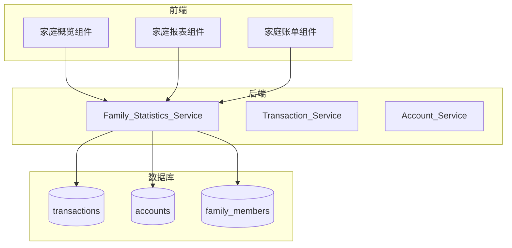

# 设计文档：家庭账单优化

## 概述

本设计优化家庭账单逻辑，核心变化是将家庭成员的所有个人账单自动汇总为家庭账单，无需手动标记。这样可以在任意时间点查看家庭整体的收支情况和总存款。

### 设计原则

1. **自动汇总** - 成员的所有交易自动纳入家庭统计，无需额外操作
2. **实时计算** - 家庭统计数据实时计算，不存储冗余数据
3. **时间边界** - 成员加入家庭后的交易才纳入统计
4. **向后兼容** - 保留现有的 `isFamily` 字段，但不再作为统计依据

## 架构



## 组件与接口

### 后端 API 接口

#### 家庭统计模块 (Family Statistics)

```typescript
// GET /api/statistics/family/:familyId/overview - 家庭概览
interface FamilyOverviewResponse {
  familyId: number;
  familyName: string;
  period: {
    year: number;
    month: number;
  };
  totalIncome: number; // 家庭总收入
  totalExpense: number; // 家庭总支出
  balance: number; // 结余
  totalAssets: number; // 家庭总存款（所有成员账户余额之和）
  memberCount: number; // 成员数量
  memberContributions: Array<{
    userId: number;
    nickname: string;
    income: number;
    expense: number;
    incomePercentage: number;
    expensePercentage: number;
  }>;
}

// GET /api/statistics/family/:familyId/assets - 家庭资产明细
interface FamilyAssetsResponse {
  familyId: number;
  totalAssets: number;
  byAccountType: Array<{
    type: string; // cash, bank, alipay, wechat, credit, other
    typeName: string;
    total: number;
  }>;
  byMember: Array<{
    userId: number;
    nickname: string;
    accounts: Array<{
      id: number;
      name: string;
      type: string;
      balance: number;
    }>;
    totalBalance: number;
  }>;
}

// GET /api/statistics/family/:familyId/yearly - 家庭年度报表
interface FamilyYearlyReportResponse {
  familyId: number;
  year: number;
  totalIncome: number;
  totalExpense: number;
  totalBalance: number;
  monthlyTrend: Array<{
    month: number;
    income: number;
    expense: number;
    balance: number;
  }>;
  categoryBreakdown: Array<{
    categoryId: number;
    categoryName: string;
    categoryIcon: string;
    amount: number;
    percentage: number;
  }>;
  memberContributions: Array<{
    userId: number;
    nickname: string;
    yearlyIncome: number;
    yearlyExpense: number;
    monthlyTrend: Array<{
      month: number;
      income: number;
      expense: number;
    }>;
  }>;
}

// GET /api/transactions/family/:familyId - 家庭账单列表
interface FamilyTransactionsQuery {
  startDate?: string;
  endDate?: string;
  memberId?: number; // 按成员筛选
  categoryId?: number;
  billTypeId?: number;
  type?: "income" | "expense";
  page?: number;
  pageSize?: number;
}

interface FamilyTransactionsResponse {
  items: Array<{
    id: number;
    userId: number;
    userNickname: string; // 记录人
    amount: number;
    type: "income" | "expense";
    categoryId: number;
    categoryName: string;
    billTypeId: number;
    billTypeName: string;
    accountId: number;
    accountName: string;
    date: string;
    note: string;
    createdAt: string;
  }>;
  total: number;
  page: number;
  pageSize: number;
}
```

### 数据查询逻辑

#### 家庭成员交易查询

核心变化：不再依赖 `isFamily` 字段，而是通过成员关系和加入时间来确定统计范围。

```typescript
// 获取家庭成员的交易记录
async function getFamilyTransactions(
  familyId: number,
  filters: FamilyTransactionsQuery
) {
  // 1. 获取家庭所有成员及其加入时间
  const members = await FamilyMember.findAll({
    where: { familyId },
    attributes: ["userId", "joinedAt"],
  });

  // 2. 构建查询条件：每个成员只统计加入后的交易
  const memberConditions = members.map((m) => ({
    userId: m.userId,
    date: { [Op.gte]: m.joinedAt }, // 只统计加入后的交易
  }));

  // 3. 查询交易记录
  const transactions = await Transaction.findAll({
    where: {
      [Op.or]: memberConditions,
      ...filters, // 应用其他筛选条件
    },
  });

  return transactions;
}
```

#### 家庭总存款计算

```typescript
// 计算家庭总存款
async function getFamilyTotalAssets(familyId: number) {
  // 1. 获取家庭所有成员
  const members = await FamilyMember.findAll({
    where: { familyId },
    attributes: ["userId"],
  });
  const memberIds = members.map((m) => m.userId);

  // 2. 汇总所有成员的账户余额
  const accounts = await Account.findAll({
    where: { userId: { [Op.in]: memberIds } },
  });

  // 3. 按类型分组统计
  const byType = {};
  let total = 0;
  for (const account of accounts) {
    total += account.balance;
    byType[account.type] = (byType[account.type] || 0) + account.balance;
  }

  return { total, byType };
}
```

## 数据模型

### 现有模型变更

无需修改现有数据模型，只需调整查询逻辑。关键点：

1. `family_members.joined_at` - 用于确定成员交易的统计起始时间
2. `transactions` 表 - 不再依赖 `is_family` 字段进行家庭统计
3. `accounts` 表 - 用于计算家庭总存款

### 查询优化

为提高查询性能，建议添加以下索引：

```sql
-- 优化家庭成员交易查询
CREATE INDEX idx_transactions_user_date ON transactions(user_id, date);

-- 优化账户余额汇总
CREATE INDEX idx_accounts_user_id ON accounts(user_id);
```

## 正确性属性

_正确性属性是系统在所有有效执行中都应保持为真的特征或行为。属性是人类可读规范和机器可验证正确性保证之间的桥梁。_

### Property 1: 家庭收支汇总正确性

_对于任意_ 家庭和任意时间段，家庭总收入应等于所有成员在该时间段内（且在其加入家庭之后）的收入之和，家庭总支出应等于所有成员在该时间段内（且在其加入家庭之后）的支出之和。

```
familyIncome = sum(member.income for member in family where transaction.date >= member.joinedAt)
familyExpense = sum(member.expense for member in family where transaction.date >= member.joinedAt)
```

**Validates: Requirements 1.2, 1.3, 1.4**

### Property 2: 家庭总存款计算正确性

_对于任意_ 家庭，家庭总存款应等于所有成员所有账户余额的总和，且按账户类型分组后的余额之和应等于总存款。

```
totalAssets = sum(account.balance for account in member.accounts for member in family)
sum(byType.values()) == totalAssets
```

**Validates: Requirements 2.1, 2.2, 2.3**

### Property 3: 家庭账单包含所有成员记录

_对于任意_ 家庭账单查询，返回的交易记录应包含所有成员在其加入家庭之后创建的所有交易记录（在筛选条件范围内）。

**Validates: Requirements 1.1, 5.1, 5.2, 5.3, 5.4**

### Property 4: 成员贡献占比总和

_对于任意_ 家庭统计，所有成员的收入占比之和应等于 100%（允许浮点误差 ±0.01），所有成员的支出占比之和应等于 100%（允许浮点误差 ±0.01）。

```
sum(member.incomePercentage for member in family) ≈ 100%
sum(member.expensePercentage for member in family) ≈ 100%
```

**Validates: Requirements 4.2, 4.3**

### Property 5: 年度报表月度数据一致性

_对于任意_ 家庭年度报表，年度总收入应等于 12 个月收入之和，年度总支出应等于 12 个月支出之和。

```
yearlyIncome = sum(month.income for month in 1..12)
yearlyExpense = sum(month.expense for month in 1..12)
```

**Validates: Requirements 3.1, 3.2**

### Property 6: 分类占比总和

_对于任意_ 家庭分类统计，所有分类的支出占比之和应等于 100%（允许浮点误差 ±0.01）。

**Validates: Requirements 3.3**

### Property 7: 成员退出后不纳入统计

_对于任意_ 已退出家庭的成员，其交易记录不应出现在该家庭的账单统计中。

**Validates: Requirements 7.2**

### Property 8: 新成员加入时间边界

_对于任意_ 新加入家庭的成员，只有其加入时间之后的交易记录才纳入家庭统计，加入之前的交易记录不纳入。

**Validates: Requirements 7.3**

### Property 9: 非成员访问拒绝

_对于任意_ 非家庭成员的用户，尝试访问该家庭的账单或统计数据时，系统应返回 403 错误。

**Validates: Requirements 7.1, 7.4**

### Property 10: 账户余额变化实时反映

_对于任意_ 成员账户余额的变化，家庭总存款应立即反映该变化，变化量应等于账户余额的变化量。

```
newTotalAssets - oldTotalAssets = newAccountBalance - oldAccountBalance
```

**Validates: Requirements 2.3**

## 错误处理

### 错误码定义

```typescript
enum FamilyStatsErrorCode {
  // 权限错误
  NOT_FAMILY_MEMBER = "NOT_FAMILY_MEMBER", // 非家庭成员
  FAMILY_NOT_FOUND = "FAMILY_NOT_FOUND", // 家庭不存在

  // 参数错误
  INVALID_DATE_RANGE = "INVALID_DATE_RANGE", // 无效的日期范围
  INVALID_MEMBER_ID = "INVALID_MEMBER_ID", // 无效的成员ID
}
```

### 错误处理策略

1. **权限验证失败** - 返回 403 状态码和明确的错误信息
2. **资源不存在** - 返回 404 状态码
3. **参数错误** - 返回 400 状态码和参数校验信息

## 测试策略

### 测试框架

- **后端单元测试**: Jest
- **后端属性测试**: fast-check
- **前端单元测试**: Vitest + Vue Test Utils

### 测试覆盖范围

1. **单元测试**

   - 家庭收支汇总计算
   - 家庭总存款计算
   - 成员贡献占比计算
   - 权限验证逻辑

2. **属性测试**

   - 收支汇总正确性（Property 1）
   - 总存款计算正确性（Property 2）
   - 成员贡献占比总和（Property 4）
   - 年度数据一致性（Property 5）
   - 分类占比总和（Property 6）
   - 成员加入时间边界（Property 8）

3. **集成测试**
   - API 端点测试
   - 权限控制测试

### 属性测试配置

- 每个属性测试运行至少 100 次迭代
- 使用 fast-check 生成随机测试数据
- 每个测试标注对应的设计属性编号
