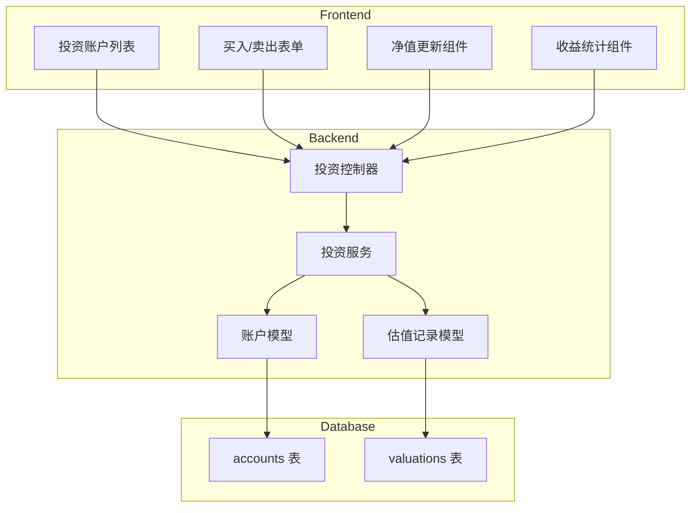

# 设计文档

## 概述

投资追踪功能为家庭记账应用新增投资类资产管理能力。核心设计理念是**简化日常操作**：用户只需记录买入/卖出操作，定期更新净值即可，系统自动计算持仓成本、当前市值和盈亏情况。

该功能扩展现有账户系统，新增 `investment` 账户类型，并引入独立的估值记录表来追踪净值历史。

## 架构



## 组件和接口

### 后端接口

#### 1. 投资账户 CRUD

```typescript
// 创建投资账户
POST /api/investment/accounts
Body: {
  name: string;           // 产品名称，如"招商中证白酒"
  shares: number;         // 初始份额
  costPrice: number;      // 初始成本价（每份）
  currentNetValue: number; // 当前净值
  icon?: string;
}

// 获取投资账户列表
GET /api/investment/accounts
Response: {
  accounts: InvestmentAccount[];
  summary: {
    totalCost: number;      // 总投入
    totalValue: number;     // 当前总市值
    totalProfit: number;    // 总盈亏
    profitRate: number;     // 收益率
  }
}

// 获取单个投资账户详情
GET /api/investment/accounts/:id
Response: InvestmentAccount & {
  valuationHistory: ValuationRecord[];
}
```

#### 2. 买入/卖出操作

```typescript
// 买入
POST /api/investment/accounts/:id/buy
Body: {
  shares: number;         // 买入份额
  price: number;          // 买入价格（每份）
  date: string;           // 交易日期
  sourceAccountId?: number; // 资金来源账户（可选）
  note?: string;
}

// 卖出
POST /api/investment/accounts/:id/sell
Body: {
  shares: number;         // 卖出份额
  price: number;          // 卖出价格（每份）
  date: string;           // 交易日期
  targetAccountId?: number; // 资金转入账户（可选）
  note?: string;
}
Response: {
  success: boolean;
  realizedProfit: number; // 实现盈亏
  newShares: number;      // 剩余份额
  newCostPrice: number;   // 新成本价
}
```

#### 3. 净值更新

```typescript
// 更新净值
POST /api/investment/accounts/:id/valuation
Body: {
  netValue: number;       // 新净值
  date?: string;          // 估值日期，默认今天
}
Response: {
  success: boolean;
  newMarketValue: number; // 新市值
  profit: number;         // 盈亏金额
  profitRate: number;     // 盈亏比例
}

// 批量更新净值
POST /api/investment/valuations/batch
Body: {
  valuations: Array<{
    accountId: number;
    netValue: number;
  }>;
  date?: string;
}
```

#### 4. 统计接口

```typescript
// 投资概览
GET /api/investment/summary
Response: {
  totalCost: number;
  totalValue: number;
  totalProfit: number;
  profitRate: number;
  accounts: InvestmentAccountSummary[];
}

// 收益趋势
GET /api/investment/trend?period=30d
Response: {
  trend: Array<{
    date: string;
    totalValue: number;
    totalProfit: number;
  }>;
}
```

### 前端组件

#### 1. InvestmentAccountCard.vue

投资账户卡片，显示：

- 产品名称和图标
- 持仓份额
- 成本价 / 当前净值
- 当前市值
- 盈亏金额和比例（红涨绿跌）

#### 2. InvestmentForm.vue

买入/卖出表单：

- 操作类型切换（买入/卖出）
- 份额输入
- 价格输入
- 日期选择
- 资金账户选择（可选）

#### 3. NetValueUpdateSheet.vue

净值更新底部弹窗：

- 快速输入净值
- 支持批量更新多个账户
- 显示更新后的市值变化

#### 4. InvestmentOverview.vue

投资概览组件：

- 总投入 / 总市值 / 总盈亏
- 收益率
- 市值趋势图

## 数据模型

### 账户表扩展 (accounts)

```sql
-- 新增账户类型
ALTER TABLE accounts MODIFY COLUMN type
  ENUM('cash', 'bank', 'alipay', 'wechat', 'credit', 'investment', 'other');

-- 投资账户扩展字段
ALTER TABLE accounts ADD COLUMN shares DECIMAL(15, 4);        -- 持仓份额
ALTER TABLE accounts ADD COLUMN cost_price DECIMAL(15, 4);    -- 成本价
ALTER TABLE accounts ADD COLUMN current_net_value DECIMAL(15, 4); -- 当前净值
```

### 估值记录表 (valuations)

```sql
CREATE TABLE valuations (
  id INT PRIMARY KEY AUTO_INCREMENT,
  account_id INT NOT NULL,
  net_value DECIMAL(15, 4) NOT NULL,    -- 净值
  market_value DECIMAL(15, 2) NOT NULL, -- 市值 = 份额 × 净值
  date DATE NOT NULL,                    -- 估值日期
  created_at DATETIME DEFAULT CURRENT_TIMESTAMP,
  FOREIGN KEY (account_id) REFERENCES accounts(id) ON DELETE CASCADE,
  UNIQUE KEY unique_account_date (account_id, date),
  INDEX idx_account_date (account_id, date)
);
```

### TypeScript 类型定义

```typescript
// 投资账户
interface InvestmentAccount {
  id: number;
  userId: number;
  name: string;
  type: "investment";
  shares: number; // 持仓份额
  costPrice: number; // 成本价（每份）
  currentNetValue: number; // 当前净值
  balance: number; // 当前市值 = shares × currentNetValue
  icon?: string;
  createdAt: string;
  // 计算字段
  totalCost: number; // 总成本 = shares × costPrice
  profit: number; // 盈亏 = balance - totalCost
  profitRate: number; // 收益率 = profit / totalCost
}

// 估值记录
interface ValuationRecord {
  id: number;
  accountId: number;
  netValue: number;
  marketValue: number;
  date: string;
  createdAt: string;
}

// 投资汇总
interface InvestmentSummary {
  totalCost: number;
  totalValue: number;
  totalProfit: number;
  profitRate: number;
  accounts: InvestmentAccount[];
}
```

### 核心计算逻辑

#### 1. 加权平均成本计算（买入时）

```typescript
function calculateNewCostPrice(
  currentShares: number,
  currentCostPrice: number,
  buyShares: number,
  buyPrice: number
): number {
  const totalCost = currentShares * currentCostPrice + buyShares * buyPrice;
  const totalShares = currentShares + buyShares;
  return totalShares > 0 ? totalCost / totalShares : 0;
}
```

#### 2. 卖出盈亏计算

```typescript
function calculateRealizedProfit(
  sellShares: number,
  sellPrice: number,
  costPrice: number
): number {
  return sellShares * (sellPrice - costPrice);
}
```

#### 3. 市值和盈亏计算

```typescript
function calculateMarketValue(shares: number, netValue: number): number {
  return shares * netValue;
}

function calculateProfit(marketValue: number, totalCost: number): number {
  return marketValue - totalCost;
}

function calculateProfitRate(profit: number, totalCost: number): number {
  return totalCost > 0 ? (profit / totalCost) * 100 : 0;
}
```

## 正确性属性

_正确性属性是系统在所有有效执行中都应该保持为真的特征或行为。属性是人类可读规范和机器可验证正确性保证之间的桥梁。_

### Property 1: 市值计算不变量

_对于任意_ 投资账户，在任何操作（买入、卖出、净值更新）之后，账户余额（balance）必须等于 持仓份额（shares）× 当前净值（currentNetValue）。

**Validates: Requirements 2.4, 3.2, 5.4**

### Property 2: 加权平均成本计算

_对于任意_ 买入操作，新的成本价必须等于 (原份额 × 原成本价 + 买入份额 × 买入价格) / (原份额 + 买入份额)。

**Validates: Requirements 2.1**

### Property 3: 卖出份额约束

_对于任意_ 卖出操作，如果卖出份额大于当前持仓份额，系统必须拒绝该操作并返回错误。

**Validates: Requirements 2.3**

### Property 4: 卖出盈亏计算

_对于任意_ 卖出操作，实现盈亏必须等于 卖出份额 × (卖出价格 - 成本价)。

**Validates: Requirements 2.2**

### Property 5: 盈亏计算一致性

_对于任意_ 投资账户，盈亏金额必须等于 当前市值 - 总成本（份额 × 成本价），收益率必须等于 盈亏金额 / 总成本 × 100%。

**Validates: Requirements 3.3, 4.1, 4.2**

### Property 6: 估值记录持久化

_对于任意_ 净值更新操作，系统必须创建一条新的估值记录，且该记录在后续查询中可被检索到。

**Validates: Requirements 3.1, 3.4**

### Property 7: 账户联动一致性

_对于任意_ 指定资金来源账户的买入操作，来源账户的余额必须减少 买入份额 × 买入价格 的金额。

**Validates: Requirements 2.5**

### Property 8: 投资账户隔离

_对于任意_ 投资类型账户，系统必须拒绝将其作为普通收支交易（income/expense）的账户。

**Validates: Requirements 5.1**

### Property 9: 级联删除

_对于任意_ 被删除的投资账户，其关联的所有估值记录必须同时被删除。

**Validates: Requirements 1.4**

### Property 10: 家庭投资汇总一致性

_对于任意_ 家庭，家庭投资总市值必须等于所有成员投资账户市值之和，且各成员占比之和等于 100%。

**Validates: Requirements 6.1, 6.2, 6.3**

## 错误处理

| 错误场景             | 错误码               | 处理方式                     |
| -------------------- | -------------------- | ---------------------------- |
| 卖出份额超过持仓     | INSUFFICIENT_SHARES  | 返回 400，提示可卖出份额     |
| 净值为负数或零       | INVALID_NET_VALUE    | 返回 400，提示净值必须大于 0 |
| 资金来源账户余额不足 | INSUFFICIENT_BALANCE | 返回 400，提示余额不足       |
| 投资账户用于普通交易 | INVALID_ACCOUNT_TYPE | 返回 400，提示账户类型不支持 |
| 账户不存在           | ACCOUNT_NOT_FOUND    | 返回 404                     |
| 无权限操作他人账户   | FORBIDDEN            | 返回 403                     |

## 测试策略

### 单元测试

- 成本价计算函数测试
- 盈亏计算函数测试
- 市值计算函数测试
- 数据验证函数测试

### 属性测试

使用 `fast-check` 库进行属性测试，每个属性至少运行 100 次迭代。

测试标注格式：`**Feature: investment-tracking, Property N: {property_text}**`

重点属性测试：

1. **市值不变量** - 生成随机操作序列，验证每次操作后 balance = shares × netValue
2. **加权平均成本** - 生成随机买入序列，验证成本价计算正确
3. **卖出约束** - 生成随机卖出请求，验证超额卖出被拒绝
4. **盈亏计算** - 生成随机账户状态，验证盈亏计算一致性

### 集成测试

- 买入 → 净值更新 → 卖出 完整流程
- 多账户批量净值更新
- 家庭投资汇总计算
