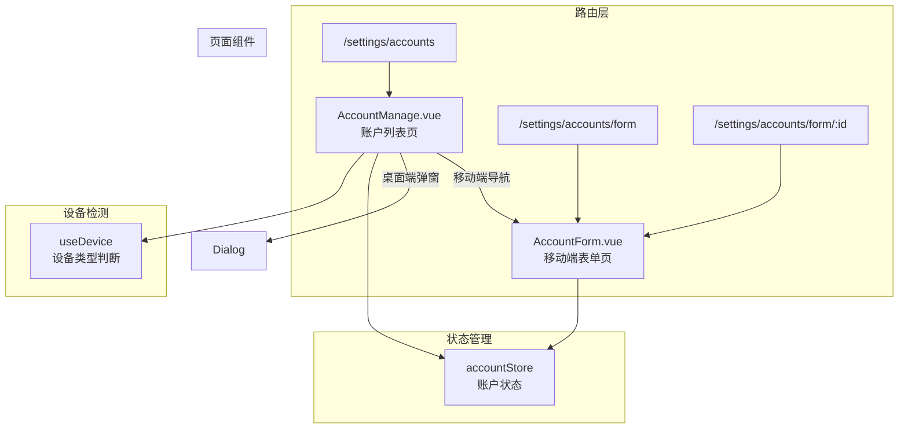

# Design Document: 移动端账户管理页面

## Overview

本设计为移动端用户提供独立的账户添加/编辑页面，替代现有的 BottomSheet 弹窗交互。设计遵循 Vue 3 Composition API 和渐进式设计原则，保持与现有代码风格一致。

核心设计思路：

1. 创建新的 `AccountForm.vue` 页面组件用于移动端
2. 添加新路由 `/settings/accounts/form` 支持添加和编辑模式
3. 修改 `AccountManage.vue` 在移动端使用路由导航而非弹窗
4. 桌面端保持现有弹窗交互不变

## Architecture



## Components and Interfaces

### 1. AccountForm.vue (新增)

移动端专用的账户表单页面组件。

```typescript
// Props
interface AccountFormProps {
  // 通过路由参数传递，无需 props
}

// 路由参数
interface RouteParams {
  id?: string; // 账户 ID，存在时为编辑模式
}

// 路由查询参数
interface RouteQuery {
  type?: AccountType; // 预设账户类型
}

// 组件内部状态
interface FormState {
  name: string;
  type: AccountType;
  initialBalance: number;
  creditLimit: number;
  billingDay: number;
  dueDay: number;
}
```

### 2. AccountManage.vue (修改)

修改现有组件，在移动端使用路由导航。

```typescript
// 新增方法
function navigateToAddAccount(): void {
  if (isMobile.value) {
    router.push("/settings/accounts/form");
  } else {
    showAddDialog();
  }
}

function navigateToEditAccount(account: Account): void {
  if (isMobile.value) {
    router.push(`/settings/accounts/form/${account.id}`);
  } else {
    handleEdit(account);
  }
}
```

### 3. 路由配置 (修改)

```typescript
// 新增路由
{
  path: 'settings/accounts/form/:id?',
  name: 'AccountForm',
  component: () => import('@/views/settings/AccountForm.vue'),
  meta: { title: '账户表单' },
}
```

## Data Models

### Account 数据模型 (现有)

```typescript
interface Account {
  id: number;
  name: string;
  type: AccountType;
  balance: number;
  // 信用账户字段
  creditLimit?: number;
  billingDay?: number;
  dueDay?: number;
}

type AccountType = "cash" | "bank" | "alipay" | "wechat" | "credit" | "other";
```

### 表单验证规则

```typescript
interface ValidationRules {
  name: {
    required: true;
    minLength: 1;
    maxLength: 50;
  };
  type: {
    required: true;
    enum: AccountType[];
  };
  initialBalance: {
    required: true; // 仅添加模式
    min: 0;
  };
  creditLimit: {
    required: true; // 仅信用账户
    min: 0;
  };
  billingDay: {
    required: true; // 仅信用账户
    range: [1, 28];
  };
  dueDay: {
    required: true; // 仅信用账户
    range: [1, 28];
  };
}
```

## Correctness Properties

_A property is a characteristic or behavior that should hold true across all valid executions of a system-essentially, a formal statement about what the system should do. Properties serve as the bridge between human-readable specifications and machine-verifiable correctness guarantees._

### Property 1: 移动端导航属性

_For any_ 移动端环境（屏幕宽度 < 768px）和任意账户操作（添加或编辑），当用户触发操作时，系统应使用路由导航到独立表单页面，而非显示弹窗。

**Validates: Requirements 1.1, 2.1, 4.2**

### Property 2: 桌面端弹窗属性

_For any_ 桌面端环境（屏幕宽度 > 768px）和任意账户操作（添加或编辑），当用户触发操作时，系统应显示弹窗，而非使用路由导航。

**Validates: Requirements 4.1**

### Property 3: 设备检测断点属性

_For any_ 屏幕宽度值，当宽度小于 768px 时 `isMobile` 应返回 `true`，否则返回 `false`。

**Validates: Requirements 4.3**

### Property 4: 信用账户字段显示属性

_For any_ 账户类型选择，当且仅当类型为 `credit` 时，表单应显示信用额度、账单日、还款日字段。

**Validates: Requirements 1.5, 2.4**

### Property 5: 表单预填充属性

_For any_ 已存在的账户，当进入编辑模式时，表单中的所有字段值应与该账户的当前数据完全一致。

**Validates: Requirements 2.3**

### Property 6: 删除按钮显示属性

_For any_ 表单模式，删除按钮应仅在编辑模式（存在账户 ID）时显示，添加模式时不显示。

**Validates: Requirements 3.1**

## Error Handling

### 表单验证错误

| 错误场景                 | 处理方式                                 |
| ------------------------ | ---------------------------------------- |
| 账户名称为空             | 显示错误提示"请输入账户名称"             |
| 账户名称过长             | 显示错误提示"账户名称不能超过 50 个字符" |
| 初始余额为负数           | 显示错误提示"初始余额不能为负数"         |
| 信用额度为空（信用账户） | 显示错误提示"请输入信用额度"             |

### 网络错误

| 错误场景         | 处理方式                     |
| ---------------- | ---------------------------- |
| 创建账户失败     | 显示错误提示，保持在表单页面 |
| 更新账户失败     | 显示错误提示，保持在表单页面 |
| 删除账户失败     | 显示错误提示，保持在表单页面 |
| 加载账户数据失败 | 显示错误提示，提供重试按钮   |

### 路由错误

| 错误场景         | 处理方式                     |
| ---------------- | ---------------------------- |
| 编辑不存在的账户 | 显示错误提示，返回账户列表页 |

## Testing Strategy

### 单元测试

使用 Vitest 进行单元测试，覆盖以下场景：

1. **AccountForm 组件测试**

   - 添加模式下表单初始状态
   - 编辑模式下表单预填充
   - 信用账户字段条件显示
   - 表单验证逻辑
   - 删除按钮条件显示

2. **AccountManage 组件测试**
   - 移动端导航行为
   - 桌面端弹窗行为

### 属性测试

使用 fast-check 进行属性测试，每个测试运行至少 100 次迭代：

1. **设备检测属性测试**

   - 验证断点判断逻辑的正确性

2. **信用账户字段显示属性测试**

   - 验证字段显示逻辑对所有账户类型的正确性

3. **表单预填充属性测试**

   - 验证编辑模式下数据预填充的正确性

4. **删除按钮显示属性测试**
   - 验证删除按钮在不同模式下的显示逻辑

### 测试配置

```typescript
// vitest.config.ts 中的属性测试配置
{
  test: {
    // 属性测试最小迭代次数
    fuzz: {
      numRuns: 100;
    }
  }
}
```

### 测试标注格式

每个属性测试必须包含以下注释：

```typescript
/**
 * Feature: mobile-account-page, Property N: [Property Title]
 * Validates: Requirements X.Y
 */
```
