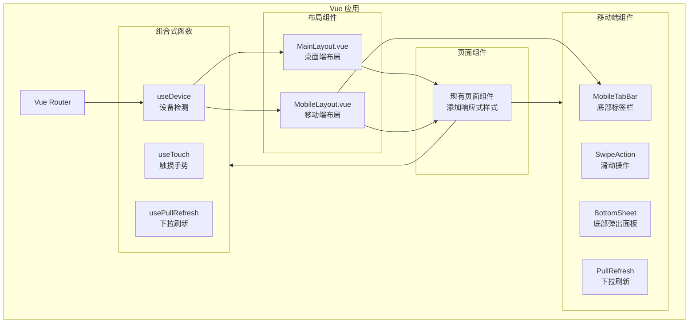

# 设计文档：移动端响应式适配

## 概述

本设计文档描述家庭记账系统的移动端响应式适配方案。采用渐进式增强策略，在保持现有 PC 端功能完整的基础上，通过 CSS 媒体查询、Vue 3 组合式函数和 Element Plus 响应式组件实现多端适配。

### 设计原则

1. **移动优先（Mobile First）**: 优先考虑移动端体验，再扩展到桌面端
2. **渐进增强**: 基础功能在所有设备可用，高级功能按设备能力增强
3. **一套代码**: 使用响应式设计，避免维护多套代码
4. **性能优先**: 移动端优化加载速度和交互流畅度

### 技术方案

- **响应式框架**: CSS 媒体查询 + CSS Grid/Flexbox
- **组件库**: Element Plus（已支持响应式）
- **状态管理**: Pinia（复用现有）
- **路由**: Vue Router（复用现有，添加移动端布局）
- **手势支持**: 原生触摸事件 + CSS touch-action
- **图表**: ECharts（已支持响应式）

## 架构



### 目录结构变更

```
frontend/src/
├── composables/                 # 新增：组合式函数
│   ├── useDevice.ts            # 设备检测
│   ├── useTouch.ts             # 触摸手势
│   └── usePullRefresh.ts       # 下拉刷新
├── components/
│   └── mobile/                  # 新增：移动端组件
│       ├── MobileTabBar.vue    # 底部标签栏
│       ├── SwipeAction.vue     # 滑动操作
│       ├── BottomSheet.vue     # 底部弹出面板
│       ├── PullRefresh.vue     # 下拉刷新
│       └── MobileHeader.vue    # 移动端顶部栏
├── layouts/
│   ├── MainLayout.vue          # 现有：桌面端布局
│   └── MobileLayout.vue        # 新增：移动端布局
├── styles/
│   ├── variables.scss          # 新增：CSS 变量
│   └── responsive.scss         # 新增：响应式样式
└── views/                       # 现有页面添加响应式样式
```

## 组件与接口

### 响应式断点定义

```scss
// styles/variables.scss
$breakpoints: (
  "mobile": 768px,
  // < 768px 移动端
  "tablet": 1024px,
  // 768px - 1024px 平板
  "desktop": 1025px // > 1024px 桌面端,
);

// 媒体查询 mixins
@mixin mobile {
  @media (max-width: #{map-get($breakpoints, 'mobile') - 1px}) {
    @content;
  }
}

@mixin tablet {
  @media (min-width: #{map-get($breakpoints, 'mobile')}) and (max-width: #{map-get($breakpoints, 'tablet')}) {
    @content;
  }
}

@mixin desktop {
  @media (min-width: #{map-get($breakpoints, 'desktop')}) {
    @content;
  }
}
```

### 设备检测组合式函数

```typescript
// composables/useDevice.ts
import { ref, onMounted, onUnmounted } from "vue";

export interface DeviceInfo {
  isMobile: boolean;
  isTablet: boolean;
  isDesktop: boolean;
  width: number;
  height: number;
  isTouch: boolean;
}

export function useDevice() {
  const device = ref<DeviceInfo>({
    isMobile: false,
    isTablet: false,
    isDesktop: true,
    width: window.innerWidth,
    height: window.innerHeight,
    isTouch: "ontouchstart" in window,
  });

  const updateDevice = () => {
    const width = window.innerWidth;
    device.value = {
      isMobile: width < 768,
      isTablet: width >= 768 && width <= 1024,
      isDesktop: width > 1024,
      width,
      height: window.innerHeight,
      isTouch: "ontouchstart" in window,
    };
  };

  onMounted(() => {
    updateDevice();
    window.addEventListener("resize", updateDevice);
  });

  onUnmounted(() => {
    window.removeEventListener("resize", updateDevice);
  });

  return { device };
}
```

### 移动端布局组件

```typescript
// layouts/MobileLayout.vue
interface MobileLayoutProps {
  title?: string;
  showBack?: boolean;
  showHeader?: boolean;
}

// 插槽
// - default: 页面内容
// - header-right: 顶部右侧操作按钮
```

### 底部标签栏组件

```typescript
// components/mobile/MobileTabBar.vue
interface TabItem {
  name: string;
  path: string;
  icon: string;
  activeIcon?: string;
}

const tabs: TabItem[] = [
  { name: "首页", path: "/", icon: "HomeFilled" },
  { name: "记账", path: "/add", icon: "Plus" },
  { name: "账单", path: "/transactions", icon: "List" },
  { name: "统计", path: "/statistics", icon: "DataAnalysis" },
  { name: "我的", path: "/profile", icon: "User" },
];
```

### 滑动操作组件

```typescript
// components/mobile/SwipeAction.vue
interface SwipeActionProps {
  leftActions?: SwipeActionItem[];
  rightActions?: SwipeActionItem[];
  threshold?: number; // 触发阈值，默认 80px
}

interface SwipeActionItem {
  text: string;
  color: string;
  backgroundColor: string;
  onClick: () => void;
}

// 事件
// - swipe-left: 左滑触发
// - swipe-right: 右滑触发
```

### 底部弹出面板组件

```typescript
// components/mobile/BottomSheet.vue
interface BottomSheetProps {
  visible: boolean;
  title?: string;
  height?: string | number; // 默认 'auto'
  closeable?: boolean;
  round?: boolean; // 圆角，默认 true
}

// 事件
// - update:visible: 显示状态变化
// - close: 关闭
```

### 下拉刷新组件

```typescript
// components/mobile/PullRefresh.vue
interface PullRefreshProps {
  loading: boolean;
  pullText?: string;
  releaseText?: string;
  loadingText?: string;
  successText?: string;
  threshold?: number; // 触发阈值，默认 50px
}

// 事件
// - refresh: 触发刷新
```

### 移动端顶部栏组件

```typescript
// components/mobile/MobileHeader.vue
interface MobileHeaderProps {
  title: string;
  showBack?: boolean;
  fixed?: boolean;
  border?: boolean;
}

// 插槽
// - left: 左侧内容（默认返回按钮）
// - right: 右侧操作按钮
```

## 数据模型

本功能不涉及数据模型变更，复用现有数据结构。

### 新增本地存储

```typescript
// 用户设备偏好
interface DevicePreference {
  preferredLayout: "auto" | "mobile" | "desktop";
  lastViewport: {
    width: number;
    height: number;
  };
}

// localStorage key: 'device_preference'
```

## 页面适配设计

### 首页仪表盘适配

```
桌面端布局:
┌─────────────────────────────────────────────┐
│  收入卡片  │  支出卡片  │  结余卡片         │
├─────────────────────┬───────────────────────┤
│    最近交易         │    预算概览           │
│                     │                       │
└─────────────────────┴───────────────────────┘

移动端布局:
┌─────────────────────┐
│     收入卡片        │
├─────────────────────┤
│     支出卡片        │
├─────────────────────┤
│     结余卡片        │
├─────────────────────┤
│     最近交易        │
│     (下拉刷新)      │
├─────────────────────┤
│     预算概览        │
└─────────────────────┘
```

### 记账页面适配

```
移动端记账流程:
┌─────────────────────┐
│  ← 记一笔           │  顶部栏
├─────────────────────┤
│   支出  |  收入     │  类型切换（可滑动）
├─────────────────────┤
│      ¥ 0.00         │  大号金额显示
├─────────────────────┤
│  ┌──┐ ┌──┐ ┌──┐    │
│  │餐│ │交│ │购│    │  分类网格
│  │饮│ │通│ │物│    │  (4列)
│  └──┘ └──┘ └──┘    │
├─────────────────────┤
│  账户: 现金    ▼    │  表单项
│  日期: 今天    ▼    │
│  备注: 输入备注     │
├─────────────────────┤
│      [ 保存 ]       │  提交按钮
└─────────────────────┘
```

### 账单列表适配

```
移动端账单卡片:
┌─────────────────────┐
│ 🍔 餐饮      -¥25.00│  ← 左滑显示操作
│ 午餐        01-12   │
└─────────────────────┘
         ↓ 左滑
┌─────────────────────┬────┬────┐
│ 🍔 餐饮      -¥25.00│编辑│删除│
│ 午餐        01-12   │    │    │
└─────────────────────┴────┴────┘
```

### "我的"页面设计

```
移动端"我的"页面:
┌─────────────────────┐
│       我的          │
├─────────────────────┤
│  👤 用户昵称        │
│     user@email.com  │
├─────────────────────┤
│  家庭管理        >  │
│  家庭账目        >  │
├─────────────────────┤
│  账户管理        >  │
│  分类管理        >  │
│  账单类型        >  │
├─────────────────────┤
│  AI 助手         >  │
├─────────────────────┤
│  退出登录           │
└─────────────────────┘
```

## 正确性属性

_正确性属性是系统在所有有效执行中都应保持为真的特征或行为。属性是人类可读规范和机器可验证正确性保证之间的桥梁。_

### Property 1: 交易卡片内容完整性

_对于任意_ 交易记录，在移动端卡片视图中渲染时，卡片应包含分类名称、金额、备注（如有）和日期四个必要信息。

**Validates: Requirements 5.2**

### Property 2: 预算卡片内容完整性

_对于任意_ 预算项，在移动端卡片视图中渲染时，卡片应包含分类名称、进度条和金额信息（已用/总额）。

**Validates: Requirements 7.2**

### Property 3: 触摸区域最小尺寸

_对于任意_ 可点击元素（按钮、链接、列表项），其触摸区域的宽度和高度都应至少为 44px。

**Validates: Requirements 11.1**

### Property 4: 触摸反馈一致性

_对于任意_ 可点击元素，在触摸时应有视觉反馈（active 状态样式变化）。

**Validates: Requirements 11.2**

### Property 5: 表单输入类型正确性

_对于任意_ 表单输入字段，应根据数据类型使用正确的 input type 或 inputmode：

- 金额输入使用 `inputmode="decimal"`
- 日期输入使用 `type="date"` 或日期选择器
- 数字输入使用 `inputmode="numeric"`

**Validates: Requirements 11.4**

## 错误处理

### 设备检测降级

```typescript
// 当 window.matchMedia 不可用时的降级处理
function detectDevice(): DeviceInfo {
  if (typeof window === 'undefined') {
    // SSR 环境，默认桌面端
    return { isMobile: false, isTablet: false, isDesktop: true, ... };
  }

  if (!window.matchMedia) {
    // 旧浏览器，使用 innerWidth 判断
    const width = window.innerWidth;
    return {
      isMobile: width < 768,
      isTablet: width >= 768 && width <= 1024,
      isDesktop: width > 1024,
      ...
    };
  }

  // 现代浏览器，使用 matchMedia
  return {
    isMobile: window.matchMedia('(max-width: 767px)').matches,
    ...
  };
}
```

### 触摸事件降级

```typescript
// 同时支持触摸和鼠标事件
function addInteractionListeners(
  element: HTMLElement,
  handlers: {
    onStart: (e: TouchEvent | MouseEvent) => void;
    onMove: (e: TouchEvent | MouseEvent) => void;
    onEnd: (e: TouchEvent | MouseEvent) => void;
  }
) {
  if ("ontouchstart" in window) {
    element.addEventListener("touchstart", handlers.onStart, { passive: true });
    element.addEventListener("touchmove", handlers.onMove, { passive: false });
    element.addEventListener("touchend", handlers.onEnd);
  } else {
    element.addEventListener("mousedown", handlers.onStart);
    element.addEventListener("mousemove", handlers.onMove);
    element.addEventListener("mouseup", handlers.onEnd);
  }
}
```

## 测试策略

### 测试框架

- **单元测试**: Vitest + Vue Test Utils
- **属性测试**: fast-check
- **E2E 测试**: Playwright（支持移动端模拟）

### 单元测试覆盖

1. **组合式函数测试**

   - useDevice: 断点检测正确性
   - useTouch: 手势识别正确性
   - usePullRefresh: 下拉刷新状态管理

2. **组件测试**
   - MobileTabBar: 标签切换、路由跳转
   - SwipeAction: 滑动距离计算、操作触发
   - BottomSheet: 显示/隐藏、高度计算
   - PullRefresh: 下拉距离、状态切换

### 属性测试覆盖

1. **Property 1 & 2**: 卡片内容完整性

   - 生成随机交易/预算数据
   - 渲染卡片组件
   - 验证必要字段存在

2. **Property 3**: 触摸区域尺寸

   - 遍历所有可点击元素
   - 检查 computed style 的 width/height
   - 验证 >= 44px

3. **Property 4**: 触摸反馈

   - 遍历所有可点击元素
   - 检查是否有 :active 伪类样式

4. **Property 5**: 输入类型
   - 遍历所有 input 元素
   - 根据字段名/用途验证 type/inputmode

### E2E 测试场景

```typescript
// Playwright 移动端测试配置
const mobileConfig = {
  viewport: { width: 375, height: 667 },
  deviceScaleFactor: 2,
  isMobile: true,
  hasTouch: true,
};

// 测试场景
describe("移动端适配", () => {
  test("首页布局正确", async ({ page }) => {
    await page.setViewportSize({ width: 375, height: 667 });
    await page.goto("/");
    // 验证底部标签栏可见
    await expect(page.locator(".mobile-tab-bar")).toBeVisible();
    // 验证统计卡片垂直排列
    const cards = page.locator(".stat-card");
    // ...
  });

  test("记账流程完整", async ({ page }) => {
    // 模拟移动端记账流程
  });

  test("左滑删除交易", async ({ page }) => {
    // 模拟滑动手势
  });
});
```

### 测试配置

```typescript
// vitest.config.ts 属性测试配置
export default defineConfig({
  test: {
    // 属性测试至少运行 100 次
    testTimeout: 30000,
  },
});

// fast-check 配置
fc.configureGlobal({
  numRuns: 100,
  verbose: true,
});
```
