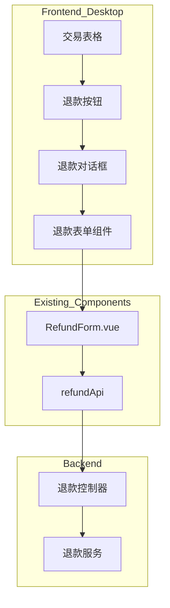
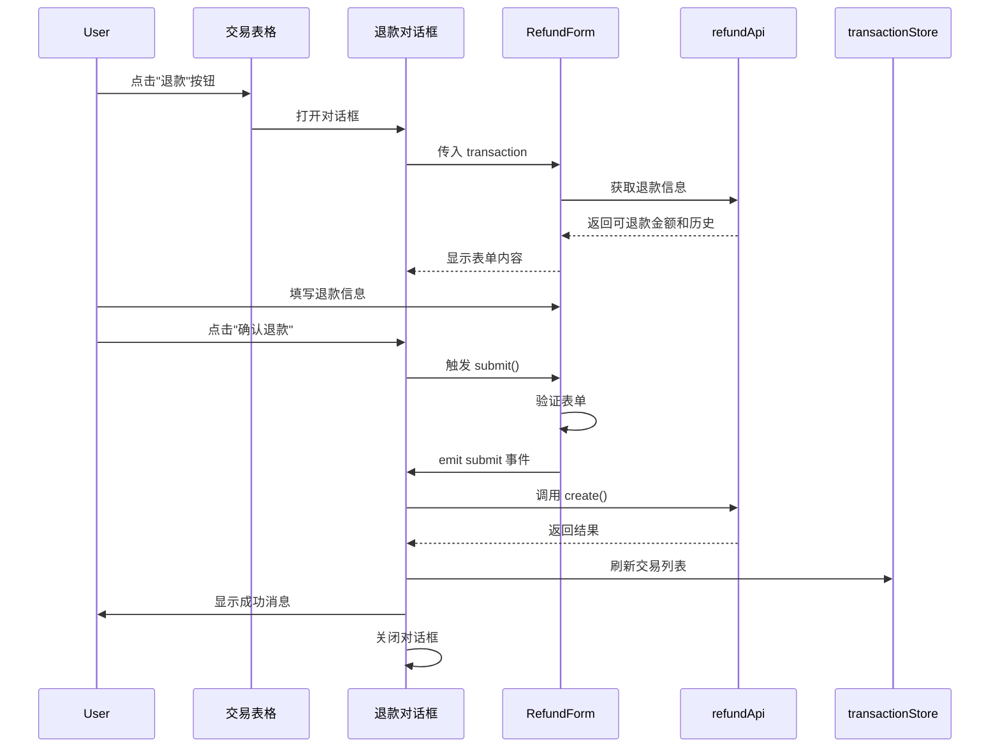

# 设计文档

## 概述

PC 端退款功能在现有的 TransactionList.vue 桌面端布局中添加退款能力。通过在交易表格的操作列添加"退款"按钮，点击后弹出 el-dialog 对话框，内嵌 RefundForm 组件完成退款操作。设计复用移动端的业务逻辑和 API 接口，但采用适合桌面端的交互模式和视觉风格。

## 架构



## 组件和接口

### 前端组件修改

#### 1. TransactionList.vue 桌面端布局扩展

在现有的桌面端表格中添加退款功能：

```vue
<!-- 在 el-table 中添加退款按钮 -->
<el-table-column label="操作" width="180" fixed="right">
  <template #default="{ row }">
    <!-- 现有按钮 -->
    <el-button type="primary" link size="small" @click="handleEdit(row)">
      编辑
    </el-button>
    <el-button type="danger" link size="small" @click="handleDelete(row)">
      删除
    </el-button>
    <!-- 新增：退款按钮（仅支出交易显示） -->
    <el-button 
      v-if="row.type === 'expense' && canRefund(row)" 
      type="warning" 
      link 
      size="small" 
      @click="handleRefund(row)"
    >
      退款
    </el-button>
  </template>
</el-table-column>
```

#### 2. 退款对话框

```vue
<!-- 退款对话框 -->
<el-dialog
  v-model="refundDialogVisible"
  title="申请退款"
  width="600px"
  :close-on-click-modal="true"
  :close-on-press-escape="true"
>
  <RefundForm
    v-if="refundTransaction"
    ref="refundFormRef"
    :transaction="refundTransaction"
    @submit="submitRefund"
  />
  <template #footer>
    <div class="dialog-footer">
      <el-button @click="refundDialogVisible = false">取消</el-button>
      <el-button
        type="primary"
        :loading="refundSubmitting"
        :disabled="!refundDataLoaded"
        @click="confirmRefund"
      >
        确认退款
      </el-button>
    </div>
  </template>
</el-dialog>
```

### 状态管理

在 TransactionList.vue 的 script setup 中添加：

```typescript
// 退款相关状态
const refundDialogVisible = ref(false);
const refundTransaction = ref<Transaction | null>(null);
const refundFormRef = ref<InstanceType<typeof RefundForm> | null>(null);
const refundSubmitting = ref(false);
const refundDataLoaded = computed(
  () => refundFormRef.value?.dataLoaded ?? false,
);

// 检查是否可以退款（需要先获取可退款金额）
const canRefund = (transaction: Transaction) => {
  // 简化版：先显示按钮，点击后在对话框中检查
  // 完整版：可以预先加载可退款金额（性能考虑）
  return transaction.type === "expense";
};

// 打开退款对话框
const handleRefund = (transaction: Transaction) => {
  refundTransaction.value = transaction;
  refundDialogVisible.value = true;
};

// 提交退款
const submitRefund = async (data: CreateRefundParams) => {
  refundSubmitting.value = true;
  try {
    await refundApi.create(data);
    ElMessage.success("退款成功");
    refundDialogVisible.value = false;
    refundTransaction.value = null;
    // 刷新交易列表
    await transactionStore.fetchTransactions({
      ...filters,
      page: page.value,
      pageSize: pageSize.value,
    });
  } catch (error: unknown) {
    const err = error as {
      response?: { data?: { message?: string } };
      message?: string;
    };
    ElMessage.error(err.response?.data?.message || err.message || "退款失败");
  } finally {
    refundSubmitting.value = false;
  }
};

// 确认退款（触发表单提交）
const confirmRefund = async () => {
  if (refundFormRef.value) {
    await refundFormRef.value.submit();
  }
};
```

### API 接口（复用现有）

使用现有的退款 API：

```typescript
// 已存在的 API
refundApi.create(data: CreateRefundParams): Promise<RefundResult>
refundApi.getTransactionRefunds(transactionId: number): Promise<RefundInfo>
```

## 数据模型

### 复用现有类型

```typescript
// 从现有类型导入
import type { Transaction, CreateRefundParams } from "@/types";

// CreateRefundParams 接口
interface CreateRefundParams {
  originalTransactionId: number;
  amount: number;
  date: string;
  note?: string;
}
```

## 组件交互流程



## 样式设计

### 对话框样式

```css
/* 退款对话框样式 */
.refund-dialog {
  /* 使用 Element Plus 默认样式 */
}

.dialog-footer {
  display: flex;
  justify-content: flex-end;
  gap: 12px;
}

/* 退款按钮在表格中的样式 */
.el-button--warning.is-link {
  color: var(--el-color-warning);
}
```

### 响应式考虑

- 对话框宽度固定 600px，适合桌面端显示
- 在小屏幕上（< 768px）自动切换到移动端布局（已有实现）
- RefundForm 组件内部样式已适配不同容器

## 正确性属性

_正确性属性是系统在所有有效执行中都应保持为真的特征或行为。属性作为人类可读规范和机器可验证正确性保证之间的桥梁。_

### Property 1: 退款按钮显示规则

_For any_ 交易记录，当且仅当交易类型为支出（expense）且可退款金额大于零时，交易表格的操作列 SHALL 显示"退款"按钮。对于收入、还款、退款类型或可退款金额为零的支出交易，SHALL NOT 显示退款按钮。

**Validates: Requirements 1.2, 1.3, 1.4**

### Property 2: 对话框打开触发

_For any_ 支出交易，当用户点击退款按钮时，退款对话框的可见性状态 SHALL 从 false 变为 true。

**Validates: Requirements 1.5**

### Property 3: 退款信息自动加载

_For any_ 交易记录，当退款对话框打开时，系统 SHALL 自动调用 API 获取该交易的退款信息（可退款金额和退款历史记录）。

**Validates: Requirements 2.4**

### Property 4: 原交易信息完整显示

_For any_ 交易记录，退款对话框 SHALL 显示原交易的所有关键信息（分类、金额、日期、备注），且显示的信息 SHALL 与原交易数据一致。

**Validates: Requirements 3.1**

### Property 5: 条件元素显示

_For any_ 退款场景，当可退款金额大于零时 SHALL 显示"全额退款"快捷按钮，当存在退款历史记录时 SHALL 显示退款记录列表。

**Validates: Requirements 3.6, 3.7**

### Property 6: 退款金额验证规则

_For any_ 退款金额输入，系统 SHALL 验证金额必须大于零且不超过可退款金额。当验证失败时 SHALL 显示错误提示，当验证通过时 SHALL 允许提交。

**Validates: Requirements 4.1, 4.2, 4.3, 4.4**

### Property 7: 表单提交流程

_For any_ 退款提交请求，系统 SHALL 先验证表单数据，验证通过后 SHALL 调用后端 API，提交期间 SHALL 显示加载状态。

**Validates: Requirements 5.1, 5.3, 5.4**

### Property 8: 退款提交反馈

_For any_ 退款提交结果，当成功时系统 SHALL 显示成功消息、关闭对话框并刷新交易列表；当失败时系统 SHALL 显示错误消息并保持对话框打开。

**Validates: Requirements 5.5, 5.6**

### Property 9: 键盘和鼠标交互

_For any_ 打开的退款对话框，当用户按 ESC 键或点击对话框外部时，对话框 SHALL 关闭。

**Validates: Requirements 7.2, 7.3**

### Property 10: 自动填充行为

_For any_ 退款场景，当退款数据加载完成时系统 SHALL 自动将可退款金额填入输入框；当用户点击"全额退款"按钮时系统 SHALL 将可退款金额填入输入框。

**Validates: Requirements 7.4, 7.5**

## 错误处理

### 错误场景

| 场景           | 错误处理       | 用户反馈                         |
| -------------- | -------------- | -------------------------------- |
| 可退款金额为零 | 不显示退款按钮 | 无（按钮不可见）                 |
| 退款金额无效   | 表单验证失败   | 输入框下方显示错误提示           |
| 网络请求失败   | catch 错误     | ElMessage.error 显示错误消息     |
| 后端返回错误   | 解析错误响应   | ElMessage.error 显示后端错误消息 |
| 表单验证失败   | 阻止提交       | 显示验证错误信息                 |

### 错误处理代码

```typescript
// 提交退款时的错误处理
const submitRefund = async (data: CreateRefundParams) => {
  refundSubmitting.value = true;
  try {
    await refundApi.create(data);
    ElMessage.success("退款成功");
    refundDialogVisible.value = false;
    refundTransaction.value = null;
    // 刷新交易列表
    await transactionStore.fetchTransactions({
      ...filters,
      page: page.value,
      pageSize: pageSize.value,
    });
  } catch (error: unknown) {
    // 优先显示后端返回的错误消息
    const err = error as {
      response?: { data?: { message?: string } };
      message?: string;
    };
    ElMessage.error(err.response?.data?.message || err.message || "退款失败");
    // 保持对话框打开，让用户可以修改后重试
  } finally {
    refundSubmitting.value = false;
  }
};
```

## 测试策略

### 单元测试

使用 Vitest 和 Vue Test Utils 进行组件测试：

1. **退款按钮显示测试**
   - 测试支出交易显示退款按钮
   - 测试收入交易不显示退款按钮
   - 测试可退款金额为零时不显示按钮

2. **对话框交互测试**
   - 测试点击退款按钮打开对话框
   - 测试 ESC 键关闭对话框
   - 测试点击外部关闭对话框

3. **表单验证测试**
   - 测试金额为零时验证失败
   - 测试金额超过可退款金额时验证失败
   - 测试有效金额时验证通过

### 属性测试

使用 fast-check 进行属性测试，每个属性至少运行 100 次迭代：

```typescript
import fc from "fast-check";
import { mount } from "@vue/test-utils";

// Property 1: 退款按钮显示规则
describe("Property 1: 退款按钮显示规则", () => {
  it("**Feature: pc-refund, Property 1: 退款按钮显示规则**", () => {
    fc.assert(
      fc.property(
        fc.record({
          type: fc.constantFrom("expense", "income", "refund", "repayment"),
          amount: fc.float({ min: 0.01, max: 10000 }),
          refundableAmount: fc.float({ min: 0, max: 10000 }),
        }),
        (transaction) => {
          // 渲染表格行
          const wrapper = mount(TransactionTableRow, {
            props: { transaction },
          });

          const refundButton = wrapper.find('[data-test="refund-button"]');
          const shouldShow =
            transaction.type === "expense" && transaction.refundableAmount > 0;

          return refundButton.exists() === shouldShow;
        },
      ),
      { numRuns: 100 },
    );
  });
});

// Property 6: 退款金额验证规则
describe("Property 6: 退款金额验证规则", () => {
  it("**Feature: pc-refund, Property 6: 退款金额验证规则**", () => {
    fc.assert(
      fc.property(
        fc.float({ min: 0.01, max: 10000 }), // 可退款金额
        fc.float({ min: -100, max: 15000 }), // 尝试输入的金额
        (refundableAmount, inputAmount) => {
          const isValid = inputAmount > 0 && inputAmount <= refundableAmount;

          // 调用验证函数
          const result = validateRefundAmount(inputAmount, refundableAmount);

          return result.valid === isValid;
        },
      ),
      { numRuns: 100 },
    );
  });
});
```

### 集成测试

使用 Playwright 进行端到端测试：

1. **完整退款流程测试**
   - 打开交易列表页面
   - 点击支出交易的退款按钮
   - 填写退款信息
   - 提交退款
   - 验证成功消息和列表刷新

2. **错误处理测试**
   - 测试网络错误时的错误提示
   - 测试后端验证错误的显示

### 测试配置

- 单元测试框架：Vitest + Vue Test Utils
- 属性测试框架：fast-check
- E2E 测试框架：Playwright
- 每个属性测试最少 100 次迭代
- 测试标签格式：`**Feature: pc-refund, Property N: 属性名称**`

## 性能考虑

### 优化策略

1. **按需加载退款信息**
   - 不在表格加载时预先获取所有交易的可退款金额
   - 仅在点击退款按钮时加载特定交易的退款信息
   - 减少不必要的 API 请求

2. **对话框懒加载**
   - 使用 v-if 而非 v-show，未打开时不渲染对话框内容
   - 减少初始渲染开销

3. **表单验证防抖**
   - 对金额输入验证进行防抖处理
   - 避免频繁的验证计算

### 性能指标

- 对话框打开响应时间：< 200ms
- 退款信息加载时间：< 500ms
- 表单提交响应时间：< 1s

## 可访问性

### ARIA 属性

```vue
<el-button
  type="warning"
  link
  size="small"
  aria-label="申请退款"
  @click="handleRefund(row)"
>
  退款
</el-button>

<el-dialog
  v-model="refundDialogVisible"
  title="申请退款"
  role="dialog"
  aria-modal="true"
  aria-labelledby="refund-dialog-title"
>
  <!-- 对话框内容 -->
</el-dialog>
```

### 键盘导航

- Tab 键在表单字段间导航
- ESC 键关闭对话框
- Enter 键提交表单（在输入框中）

## 国际化考虑

虽然当前版本使用中文，但设计支持未来的国际化：

```typescript
// 可以使用 i18n
const t = useI18n();

// 文本可以提取为常量
const TEXTS = {
  refundButton: "退款",
  dialogTitle: "申请退款",
  confirmButton: "确认退款",
  successMessage: "退款成功",
  errorMessage: "退款失败",
};
```
