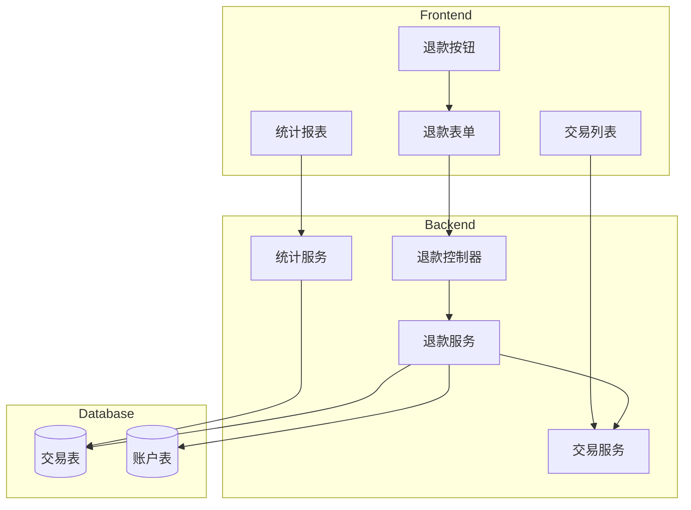

# 设计文档

## 概述

退款功能扩展现有的交易系统，新增 `refund` 交易类型，通过 `originalTransactionId` 字段关联原始支出交易。系统在创建退款时验证金额合法性，自动更新账户余额，并在统计计算中正确处理退款对支出的抵消。

## 架构



## 组件和接口

### 数据库变更

扩展 `transactions` 表，添加以下字段：

```sql
ALTER TABLE transactions
ADD COLUMN original_transaction_id INT UNSIGNED NULL,
ADD CONSTRAINT fk_original_transaction
    FOREIGN KEY (original_transaction_id)
    REFERENCES transactions(id)
    ON DELETE CASCADE;

-- 更新 type 枚举，添加 refund 类型
ALTER TABLE transactions
MODIFY COLUMN type ENUM('income', 'expense', 'repayment', 'refund') NOT NULL;
```

### 后端接口

#### 1. 创建退款

```typescript
// POST /api/refunds
interface CreateRefundRequest {
  originalTransactionId: number; // 原始交易 ID
  amount: number; // 退款金额
  date: string; // 退款日期
  note?: string; // 备注
}

interface CreateRefundResponse {
  success: boolean;
  data: {
    refund: Transaction; // 退款交易记录
    originalTransaction: {
      id: number;
      amount: number;
      refundedAmount: number; // 已退款总额
      refundableAmount: number; // 剩余可退款金额
    };
    accountBalance: number; // 更新后的账户余额
  };
}
```

#### 2. 获取交易退款信息

```typescript
// GET /api/transactions/:id/refunds
interface TransactionRefundsResponse {
  success: boolean;
  data: {
    originalTransaction: Transaction;
    refunds: Transaction[]; // 关联的退款记录列表
    totalRefunded: number; // 已退款总额
    refundableAmount: number; // 剩余可退款金额
  };
}
```

#### 3. 删除退款

```typescript
// DELETE /api/refunds/:id
// 复用现有的交易删除接口，但需要特殊处理退款类型
```

### 前端组件

#### 1. RefundButton 组件

```vue
<!-- 退款按钮，显示在支出交易详情中 -->
<template>
  <van-button
    v-if="canRefund"
    type="warning"
    size="small"
    @click="showRefundForm"
  >
    退款
  </van-button>
</template>
```

#### 2. RefundForm 组件

```vue
<!-- 退款表单 -->
<template>
  <van-popup v-model:show="visible" position="bottom" round>
    <div class="refund-form">
      <div class="original-info">
        <p>原交易金额: ¥{{ originalAmount }}</p>
        <p>已退款金额: ¥{{ refundedAmount }}</p>
        <p>可退款金额: ¥{{ refundableAmount }}</p>
      </div>
      <van-field
        v-model="amount"
        type="number"
        label="退款金额"
        :max="refundableAmount"
      />
      <van-field v-model="date" label="退款日期" />
      <van-field v-model="note" label="备注" />
      <van-button type="primary" @click="submitRefund">确认退款</van-button>
    </div>
  </van-popup>
</template>
```

### 服务层设计

#### RefundService

```typescript
class RefundService {
  // 创建退款
  async createRefund(data: CreateRefundData): Promise<RefundResult> {
    // 1. 验证原始交易存在且为支出类型
    // 2. 计算可退款金额
    // 3. 验证退款金额合法性
    // 4. 创建退款交易记录
    // 5. 更新账户余额
    // 6. 返回结果
  }

  // 获取交易的退款信息
  async getRefundInfo(transactionId: number): Promise<RefundInfo> {
    // 1. 获取原始交易
    // 2. 查询关联的退款记录
    // 3. 计算已退款总额和可退款金额
  }

  // 计算可退款金额
  async calculateRefundableAmount(transactionId: number): Promise<number> {
    // 原交易金额 - 已退款总额
  }

  // 删除退款（恢复账户余额）
  async deleteRefund(refundId: number, userId: number): Promise<void> {
    // 1. 验证退款记录存在
    // 2. 恢复账户余额
    // 3. 删除退款记录
  }
}
```

## 数据模型

### Transaction 模型扩展

```typescript
// 交易类型扩展
export type TransactionType = "income" | "expense" | "repayment" | "refund";

// 交易属性扩展
export interface TransactionAttributes {
  // ... 现有字段
  originalTransactionId?: number | null; // 退款关联的原始交易 ID
}
```

### 退款相关类型定义

```typescript
// 创建退款参数
export interface CreateRefundParams {
  originalTransactionId: number;
  amount: number;
  date: string;
  note?: string;
}

// 退款信息
export interface RefundInfo {
  originalTransaction: Transaction;
  refunds: Transaction[];
  totalRefunded: number;
  refundableAmount: number;
}

// 退款结果
export interface RefundResult {
  refund: Transaction;
  originalTransaction: {
    id: number;
    amount: number;
    refundedAmount: number;
    refundableAmount: number;
  };
  accountBalance: number;
}
```

## 正确性属性

_正确性属性是系统在所有有效执行中都应保持为真的特征或行为。属性作为人类可读规范和机器可验证正确性保证之间的桥梁。_

### Property 1: 退款创建关联性

_For any_ 支出交易，当创建退款时，退款交易的类型 SHALL 为 `refund`，且 `originalTransactionId` SHALL 等于原始支出交易的 ID。

**Validates: Requirements 1.1, 3.1**

### Property 2: 退款金额验证

_For any_ 退款请求，退款金额必须满足：`0 < refundAmount <= refundableAmount`，其中 `refundableAmount = originalAmount - totalRefunded`。任何不满足此条件的退款请求 SHALL 被拒绝。

**Validates: Requirements 1.2, 1.3, 2.2, 2.3, 2.4**

### Property 3: 非信用账户退款余额更新

_For any_ 非信用账户的支出退款，退款后账户余额 SHALL 等于退款前余额加上退款金额：`newBalance = oldBalance + refundAmount`。

**Validates: Requirements 1.4, 1.5**

### Property 4: 信用账户退款待还金额更新

_For any_ 信用账户的支出退款，退款后待还金额 SHALL 等于退款前待还金额减去退款金额：`newOutstanding = oldOutstanding - refundAmount`。

**Validates: Requirements 1.6**

### Property 5: 可退款金额计算

_For any_ 支出交易及其关联的退款记录列表，可退款金额 SHALL 等于原交易金额减去所有退款金额之和：`refundableAmount = originalAmount - sum(refundAmounts)`。

**Validates: Requirements 2.1, 3.2, 3.3**

### Property 6: 退款级联删除

_For any_ 支出交易，当该交易被删除时，所有关联的退款记录 SHALL 同时被删除。

**Validates: Requirements 3.4**

### Property 7: 退款统计计算

_For any_ 月度统计计算，净支出 SHALL 等于总支出减去总退款：`netExpense = totalExpense - totalRefund`。分类净支出同样适用此规则。

**Validates: Requirements 4.1, 4.2, 4.4**

### Property 8: 删除退款恢复

_For any_ 退款交易被删除时，账户余额 SHALL 恢复（减少之前增加的退款金额），且原交易的可退款金额 SHALL 相应增加。

**Validates: Requirements 5.3, 5.4**

### Property 9: 退款类型筛选

_For any_ 交易列表筛选请求，当筛选类型为 `refund` 时，返回的所有交易 SHALL 类型为 `refund`。

**Validates: Requirements 6.4**

## 错误处理

### 错误码定义

| 错误码                    | 错误信息               | 触发条件                   |
| ------------------------- | ---------------------- | -------------------------- |
| REFUND_ORIGINAL_NOT_FOUND | 原始交易不存在         | originalTransactionId 无效 |
| REFUND_INVALID_TYPE       | 只能对支出交易进行退款 | 原交易类型不是 expense     |
| REFUND_AMOUNT_EXCEEDED    | 退款金额超过可退款金额 | amount > refundableAmount  |
| REFUND_AMOUNT_INVALID     | 退款金额必须为正数     | amount <= 0                |
| REFUND_ALREADY_FULL       | 该交易已全额退款       | refundableAmount = 0       |
| REFUND_NOT_FOUND          | 退款记录不存在         | 删除/编辑时找不到退款      |

### 错误处理流程

```typescript
// 创建退款时的错误处理
async createRefund(data: CreateRefundParams) {
  // 1. 验证原交易存在
  const original = await Transaction.findByPk(data.originalTransactionId);
  if (!original) {
    throw new AppError('原始交易不存在', 404, 'REFUND_ORIGINAL_NOT_FOUND');
  }

  // 2. 验证原交易类型
  if (original.type !== 'expense') {
    throw new AppError('只能对支出交易进行退款', 400, 'REFUND_INVALID_TYPE');
  }

  // 3. 验证退款金额
  if (data.amount <= 0) {
    throw new AppError('退款金额必须为正数', 400, 'REFUND_AMOUNT_INVALID');
  }

  const refundableAmount = await this.calculateRefundableAmount(original.id);
  if (refundableAmount === 0) {
    throw new AppError('该交易已全额退款', 400, 'REFUND_ALREADY_FULL');
  }
  if (data.amount > refundableAmount) {
    throw new AppError('退款金额超过可退款金额', 400, 'REFUND_AMOUNT_EXCEEDED');
  }

  // 4. 创建退款...
}
```

## 测试策略

### 单元测试

单元测试用于验证特定示例和边界条件：

1. **退款金额边界测试**

   - 测试退款金额等于可退款金额（全额退款）
   - 测试退款金额为 0.01（最小有效金额）
   - 测试退款金额为 0（应拒绝）
   - 测试退款金额为负数（应拒绝）

2. **账户类型测试**

   - 测试现金账户退款
   - 测试银行账户退款
   - 测试信用账户退款

3. **错误处理测试**
   - 测试原交易不存在
   - 测试对收入交易退款（应拒绝）
   - 测试对还款交易退款（应拒绝）

### 属性测试

使用 fast-check 进行属性测试，每个属性至少运行 100 次迭代：

```typescript
import fc from "fast-check";

// Property 2: 退款金额验证
describe("Property 2: 退款金额验证", () => {
  it("**Feature: refund, Property 2: 退款金额验证**", () => {
    fc.assert(
      fc.property(
        fc.float({ min: 0.01, max: 10000 }), // 原交易金额
        fc.float({ min: 0, max: 10000 }), // 已退款金额
        fc.float({ min: -100, max: 15000 }), // 尝试退款金额
        (originalAmount, refundedAmount, attemptAmount) => {
          const refundableAmount = Math.max(0, originalAmount - refundedAmount);
          const isValid =
            attemptAmount > 0 && attemptAmount <= refundableAmount;

          // 验证系统对有效/无效金额的处理
          const result = validateRefundAmount(attemptAmount, refundableAmount);
          return result.valid === isValid;
        }
      ),
      { numRuns: 100 }
    );
  });
});

// Property 5: 可退款金额计算
describe("Property 5: 可退款金额计算", () => {
  it("**Feature: refund, Property 5: 可退款金额计算**", () => {
    fc.assert(
      fc.property(
        fc.float({ min: 0.01, max: 10000 }), // 原交易金额
        fc.array(fc.float({ min: 0.01, max: 1000 })), // 退款金额列表
        (originalAmount, refundAmounts) => {
          const totalRefunded = refundAmounts.reduce((sum, a) => sum + a, 0);
          const expectedRefundable = Math.max(
            0,
            originalAmount - totalRefunded
          );

          const calculated = calculateRefundableAmount(
            originalAmount,
            refundAmounts
          );
          return Math.abs(calculated - expectedRefundable) < 0.01;
        }
      ),
      { numRuns: 100 }
    );
  });
});
```

### 测试配置

- 属性测试框架：fast-check
- 单元测试框架：Jest
- 每个属性测试最少 100 次迭代
- 测试标签格式：`**Feature: refund, Property N: 属性名称**`
