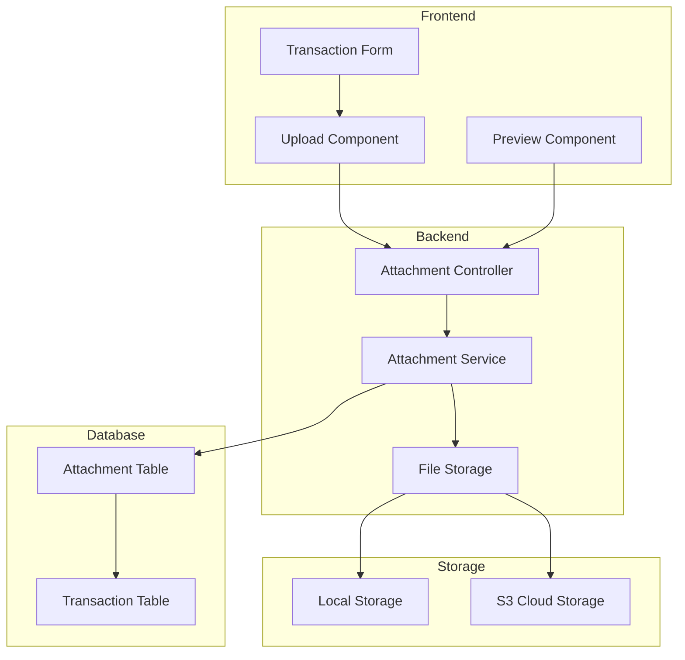

# Design Document: Transaction Attachments

## Overview

本设计文档描述交易附件功能的技术实现方案。该功能允许用户在记账时上传图片、PDF、视频等附件，用于保存发票、菜单、收据等凭证。

系统采用前后端分离架构：

- 前端使用 Vue 3 + Element Plus 实现上传和预览组件
- 后端使用 Express + Multer 处理文件上传
- 文件存储支持本地存储和云存储（S3）两种模式

## Architecture



## Components and Interfaces

### Backend Components

#### 1. Attachment Model

```typescript
interface AttachmentAttributes {
  id: number;
  transactionId: number | null; // 可为空，支持先上传后关联
  userId: number;
  filename: string; // 原始文件名
  storagePath: string; // 存储路径/key
  mimeType: string; // 文件 MIME 类型
  size: number; // 文件大小（字节）
  thumbnailPath?: string; // 缩略图路径（图片/视频）
  createdAt: Date;
  updatedAt: Date;
}
```

#### 2. Attachment Service

```typescript
interface AttachmentService {
  // 上传附件
  upload(file: Express.Multer.File, userId: number): Promise<Attachment>;

  // 关联附件到交易
  linkToTransaction(
    attachmentIds: number[],
    transactionId: number
  ): Promise<void>;

  // 获取交易的附件列表
  getByTransactionId(
    transactionId: number,
    userId: number
  ): Promise<Attachment[]>;

  // 删除附件
  delete(attachmentId: number, userId: number): Promise<void>;

  // 删除交易的所有附件
  deleteByTransactionId(transactionId: number): Promise<void>;

  // 生成访问 URL
  getAccessUrl(attachment: Attachment): Promise<string>;

  // 验证文件
  validateFile(file: Express.Multer.File): ValidationResult;
}

interface ValidationResult {
  valid: boolean;
  error?: string;
}
```

#### 3. File Storage Interface

```typescript
interface FileStorage {
  // 保存文件
  save(file: Buffer, filename: string, mimeType: string): Promise<string>;

  // 删除文件
  delete(storagePath: string): Promise<void>;

  // 生成访问 URL
  getUrl(storagePath: string, expiresIn?: number): Promise<string>;

  // 生成缩略图
  generateThumbnail(
    storagePath: string,
    mimeType: string
  ): Promise<string | null>;
}

// 本地存储实现
class LocalFileStorage implements FileStorage {}

// S3 存储实现
class S3FileStorage implements FileStorage {}
```

#### 4. Attachment Controller

```typescript
// POST /api/attachments/upload
// 上传单个附件，返回附件信息

// POST /api/attachments/upload-multiple
// 批量上传附件，返回附件列表

// GET /api/attachments/:id
// 获取附件信息和访问 URL

// GET /api/attachments/transaction/:transactionId
// 获取交易的所有附件

// DELETE /api/attachments/:id
// 删除附件

// POST /api/attachments/link
// 将附件关联到交易
```

### Frontend Components

#### 1. AttachmentUpload Component

```vue
<template>
  <div class="attachment-upload">
    <el-upload
      :action="uploadUrl"
      :headers="headers"
      :multiple="true"
      :limit="5"
      :accept="acceptTypes"
      :before-upload="beforeUpload"
      :on-success="onSuccess"
      :on-error="onError"
      :on-exceed="onExceed"
      :file-list="fileList"
      list-type="picture-card"
      drag
    >
      <el-icon><Plus /></el-icon>
      <template #tip>
        <div class="upload-tip">支持图片、PDF、视频，单个文件最大 10MB</div>
      </template>
    </el-upload>
  </div>
</template>
```

Props:

- `modelValue: Attachment[]` - 已上传的附件列表
- `transactionId?: number` - 关联的交易 ID
- `maxCount?: number` - 最大上传数量，默认 5

Events:

- `update:modelValue` - 附件列表变化
- `upload-success` - 上传成功
- `upload-error` - 上传失败

#### 2. AttachmentPreview Component

```vue
<template>
  <el-image-viewer
    v-if="previewVisible && isImage"
    :url-list="imageUrls"
    :initial-index="currentIndex"
    @close="closePreview"
  />
  <el-dialog v-else-if="previewVisible && isVideo" @close="closePreview">
    <video :src="currentUrl" controls />
  </el-dialog>
</template>
```

Props:

- `attachments: Attachment[]` - 附件列表
- `visible: boolean` - 是否显示预览
- `initialIndex?: number` - 初始预览索引

Events:

- `update:visible` - 可见性变化
- `close` - 关闭预览

#### 3. AttachmentList Component

```vue
<template>
  <div class="attachment-list">
    <div
      v-for="(attachment, index) in attachments"
      :key="attachment.id"
      class="attachment-item"
      @click="preview(index)"
    >
      
      <el-icon v-else><Document /></el-icon>
      <span class="filename">{{ attachment.filename }}</span>
    </div>
  </div>
</template>
```

## Data Models

### Database Schema

```sql
CREATE TABLE attachments (
  id INT UNSIGNED AUTO_INCREMENT PRIMARY KEY,
  transaction_id INT UNSIGNED NULL,
  user_id INT UNSIGNED NOT NULL,
  filename VARCHAR(255) NOT NULL,
  storage_path VARCHAR(500) NOT NULL,
  mime_type VARCHAR(100) NOT NULL,
  size INT UNSIGNED NOT NULL,
  thumbnail_path VARCHAR(500) NULL,
  created_at TIMESTAMP DEFAULT CURRENT_TIMESTAMP,
  updated_at TIMESTAMP DEFAULT CURRENT_TIMESTAMP ON UPDATE CURRENT_TIMESTAMP,

  FOREIGN KEY (transaction_id) REFERENCES transactions(id) ON DELETE CASCADE,
  FOREIGN KEY (user_id) REFERENCES users(id) ON DELETE CASCADE,
  INDEX idx_transaction_id (transaction_id),
  INDEX idx_user_id (user_id)
);
```

### File Validation Rules

| 文件类型 | MIME Types                                   | 最大大小 |
| -------- | -------------------------------------------- | -------- |
| 图片     | image/jpeg, image/png, image/gif, image/webp | 10MB     |
| PDF      | application/pdf                              | 10MB     |
| 视频     | video/mp4, video/quicktime                   | 50MB     |

## Correctness Properties

_A property is a characteristic or behavior that should hold true across all valid executions of a system-essentially, a formal statement about what the system should do. Properties serve as the bridge between human-readable specifications and machine-verifiable correctness guarantees._

### Property 1: File Validation Correctness

_For any_ file with a given MIME type and size, the validation function should return `valid: true` if and only if:

- The MIME type is in the allowed list (image/jpeg, image/png, image/gif, image/webp, application/pdf, video/mp4, video/quicktime)
- The file size does not exceed the limit for its type (10MB for images/PDF, 50MB for videos)

**Validates: Requirements 1.2, 2.1, 2.2, 2.3, 2.4, 2.5, 2.6**

### Property 2: Attachment Count Limit

_For any_ upload operation with N files where N > 5, the system should reject the upload and only accept at most 5 files.

**Validates: Requirements 1.7**

### Property 3: Transaction-Attachment Association

_For any_ transaction with attachments, after linking attachments to the transaction:

- All linked attachments should have the correct transactionId
- Querying attachments by transactionId should return exactly the linked attachments

**Validates: Requirements 1.5, 4.1**

### Property 4: Attachment Deletion Cascade

_For any_ transaction with attachments, when the transaction is deleted:

- All associated attachment records should be deleted from the database
- All associated files should be deleted from storage

**Validates: Requirements 4.4**

### Property 5: Unique Storage Path

_For any_ two file uploads (even with the same filename), the generated storage paths should be different.

**Validates: Requirements 7.1**

### Property 6: Access Control

_For any_ user A and attachment owned by user B where A ≠ B, user A should not be able to:

- View the attachment
- Delete the attachment
- Get the access URL

**Validates: Requirements 7.2**

### Property 7: Thumbnail Generation for Images

_For any_ uploaded image file, the system should generate a thumbnail with:

- Width ≤ 200px
- Preserved aspect ratio

**Validates: Requirements 5.3, 6.3**

### Property 8: Attachment Icon Display

_For any_ transaction with at least one attachment, the transaction list should display an attachment indicator icon.

**Validates: Requirements 5.1**

## Error Handling

| 错误场景       | 错误码                   | 错误信息                                       |
| -------------- | ------------------------ | ---------------------------------------------- |
| 文件类型不支持 | INVALID_FILE_TYPE        | 不支持的文件类型，请上传图片、PDF 或视频       |
| 文件过大       | FILE_TOO_LARGE           | 文件大小超过限制（图片/PDF: 10MB，视频: 50MB） |
| 超过数量限制   | TOO_MANY_FILES           | 最多只能上传 5 个附件                          |
| 附件不存在     | ATTACHMENT_NOT_FOUND     | 附件不存在                                     |
| 无权访问       | ATTACHMENT_ACCESS_DENIED | 无权访问此附件                                 |
| 上传失败       | UPLOAD_FAILED            | 文件上传失败，请重试                           |
| 存储错误       | STORAGE_ERROR            | 文件存储失败                                   |

## Testing Strategy

### Unit Tests

1. **File Validation Tests**

   - 测试各种 MIME 类型的验证
   - 测试文件大小边界值
   - 测试无效文件类型的错误处理

2. **Storage Path Generation Tests**

   - 测试路径唯一性
   - 测试路径格式正确性

3. **Thumbnail Generation Tests**
   - 测试图片缩略图生成
   - 测试非图片文件不生成缩略图

### Property-Based Tests

使用 fast-check 进行属性测试：

1. **File Validation Property Test**

   - 生成随机 MIME 类型和文件大小
   - 验证验证函数的正确性

2. **Unique Path Property Test**

   - 生成多个随机文件名
   - 验证生成的存储路径唯一

3. **Access Control Property Test**
   - 生成随机用户和附件组合
   - 验证权限检查的正确性

### Integration Tests

1. **Upload Flow Test**

   - 测试完整的上传流程
   - 验证文件正确存储

2. **Transaction Association Test**
   - 测试附件与交易的关联
   - 验证级联删除

### E2E Tests (Playwright)

1. **Upload UI Test**

   - 测试拖拽上传
   - 测试文件选择上传
   - 测试上传进度显示

2. **Preview UI Test**
   - 测试图片预览
   - 测试 PDF 打开
   - 测试视频播放
